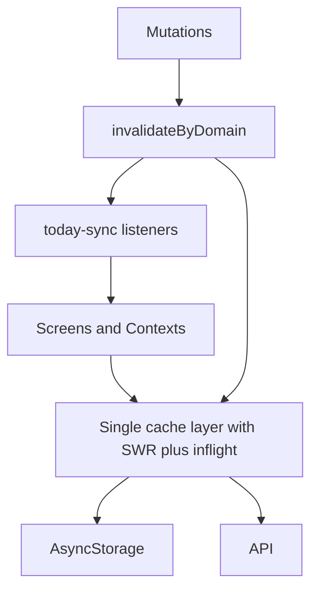

# Cache consolidation plan

Roadmap to fix fragmented caching in RoundFit: one cache layer, one invalidation map, and removal of duplicate stores. Roll out in five phases so the app stays shippable after each step.

## Target end state

### Single cache layer

Extend `resource-cache` (or rename to `app-cache`) with:

- Memory + AsyncStorage + TTL + `isStale`
- `fetchWithCache(key, ttl, fetcher, { force, staleOk })` with inflight dedup
- `getCached` always usable for stale-while-revalidate (show stale, revalidate in background)
- Domain keys only via builders: `food-logs`, `workouts`, `daily-summary`, `insights-week`, etc.

### Single invalidation API

```ts
invalidateAfterMutation('food' | 'workout' | 'water' | 'health' | …, { userId, date })
```

Each domain maps to every key that must drop (today summary, insights day/week, related resource keys). No separate home-screen bundle cache.

### Screens and contexts

- Read through cache helpers or domain context
- No screen-local AsyncStorage for API data unless UI-only (e.g. HealthKit sleep segments on device)

### Architecture diagram



---

## Phase 1 — Foundation ✅ Done

**Goal:** Low risk; unlocks all later phases.

### 1. Extend `resource-cache` ✅

Add to the existing module (keep exports stable at first):

| Capability | Purpose |
|------------|---------|
| `fetchWithCache(..., { allowStale: true })` | If expired, return stale immediately and still run one background fetch |
| `invalidateKeys(keys[])` | Batch delete mem + AsyncStorage + inflight |
| `invalidateByPrefix(prefix)` | Optional cleanup on logout |
| Move `insights-cache` read/write/invalidate | Re-export from `insights-cache.ts` as thin wrappers; delete duplicate in-memory map later |

### 2. Add `utils/cache-invalidation.ts` ✅

Central map, for example:

- `food` → `food-logs:{date}`, `invalidateUserDayCaches`, no home-specific key
- `workout` → `workouts:{date}`, `workout-date-cache` (until removed), day caches
- `water` → `water:{date}`, summary today (or `syncTodayAfterMutation`)
- `health` → `health:{date}`, day caches if health affects home
- `profile-targets` → no network; `notifyTodayTargetsChanged` only

Replace scattered `invalidateResourceCache` + `syncTodayAfterMutation` calls with:

```ts
invalidateAfterMutation('food', { userId, date })
```

### 3. Fix `syncTodayAfterMutation` ✅ (`notifyTodayDataChanged` + domain-scoped listeners)

Treat as “today aggregates changed”:

- Invalidate `daily-summary`, `insights day`, `insights week`, `summary-weekly` (+ raw), `engine-daily` / `patterns` as needed
- Keep listener fan-out; listeners only refetch what they own

### 4. Unify weekly summary key ✅ (`resource:summary-weekly`)

Pick one key, e.g. `resource:summary-weekly:{userId}:{weekStart}`.

- `summary-context` and `use-weekly-insights` both use it
- Store one shape (raw API body or parsed `WeeklySummary`); insights hook maps on read

### Phase 1 done when

- No duplicate `/summary/weekly` for the same week
- Mutations call one invalidation function

---

## Phase 2 — Remove duplicate stores ✅ Done

**Goal:** Medium risk; large payoff on consistency and disk use.

### 5. Delete `workout-date-cache.ts` ✅

- `fetchWorkouts` / `fetchForDate` use only `resource-cache`
- Remove memory-first branch in `workout-context` mount effect

### 6. Remove home `day_cache` ✅ (`hooks/use-day-logs.ts`)

In `app/(tabs)/index.tsx` for past days:

- Derive meals/workouts from `fetchMealsForDate` / `fetchWorkoutsForDate` (already in resource cache), or
- Add `useDayLogs(date)` hook: `getCached` → state → `fetchWithCache` with SWR
- Drop `@roundfit/day_cache/` AsyncStorage
- Pull-to-refresh: `fetchForDate(date, { force: true })` only

The L1/L2 TTL bug on home is fixed by removing this layer, not patching it.

### 7. Sleep screen → shared health cache ✅ (`health.fetchForDate`)

- Expose `fetchHealthForDate(date)` from `health-context` (wrap `fetchByDate`)
- Replace `healthCache` ref + raw `apiFetch` in `app/(tabs)/log/sleep.tsx`

### Phase 2 done when

- One path for meals, workouts, and health per date
- Home historical days survive restart with the same TTL as log screens

---

## Phase 3 — Consistent SWR UX ✅ Done

**Goal:** Same loading/stale behavior everywhere.

### 8. Standard hook: `useCachedResource` ✅

Contract (mirror `use-weekly-insights`):

```ts
{ data, isLoading, isRefreshing, isStale, error, refresh }
```

- First paint: `getCached` → set data; `isLoading = false` if hit
- If stale or miss: `fetchWithCache` with `allowStale`
- `refresh()` → invalidate + force fetch

### 9. Migrate consumers ✅ (foreground helpers on food/workout/water/summary; daily insights SWR; contexts use `allowStale` on resource cache)

| Consumer | Change |
|----------|--------|
| `use-daily-insights` | SWR via `getCachedSummary` + stale flag |
| Food / workout / water / health mount effects | Hook or shared `hydrateThenFetch` |
| Contexts | Thin wrappers; provider state fed by same helper |

### 10. Foreground policy ✅ (`utils/foreground-refetch.ts`)

One helper, e.g. `shouldRefetchOnForeground(lastFetchAt, { dayRolled })`:

- Reuse `TTL_FOREGROUND_SKIP_MS` from summary
- Apply to food, workouts, water like summary/engine

### Phase 3 done when

- Major screens show cached data instantly and refresh quietly
- No flash to empty unless truly cold

---

## Phase 4 — Water + summary alignment ✅ Done

**Goal:** Product correctness for water logging.

### 11. Water mutations ✅

On `logWater` / `deleteEntry` in `water-context`:

```ts
await invalidateAfterMutation('water', { userId, date: today })
```

Map includes:

- `water:{date}` resource key
- `daily-summary:{today}` (water_glasses on summary)
- Optional: `applyTodayOptimistic({ waterGlasses })` if home still shows glasses

Decide single source of truth: **ml in water API** vs **glasses in summary** — server sync + summary invalidation, or stop showing summary glasses until refetch.

### 12. Water `setGoal` ✅

Invalidate water key after profile PATCH so goal survives restart.

### Phase 4 done when

- Logging water updates water screen and any summary/home water UI without waiting for TTL

---

## Phase 5 — Hygiene ✅ Done

**Goal:** Long-term storage and performance.

### 13. Storage eviction ✅ (`utils/clear-user-caches.ts` on sign-out / delete account)

- On logout: `invalidateByPrefix` for `resource:`, `daily-summary:`, `insights:`
- Optional: cap last 30 days per `kind` on write

### 14. Prefetch ✅ (home date strip ±1 day)

On home date change: prefetch adjacent days via `fetchMealsForDate` / `fetchWorkoutsForDate` (normal TTL, no force).

### 15. Deprecate `insights-cache.ts` ✅ (delegates to `resource-cache`)

After migration, file only re-exports key builders or merges into `resource-cache`.

### Phase 5 done when

- AsyncStorage does not grow unbounded across users/dates
- Adjacent home dates feel instant

---

## Suggested PR order

| PR | Scope | Risk |
|----|--------|------|
| 1 | `cache-invalidation.ts` + weekly key unification + water invalidation | Low |
| 2 | Extend `resource-cache` SWR + widen `syncTodayAfterMutation` | Low |
| 3 | Remove `workout-date-cache` | Low |
| 4 | Remove home `day_cache` | Medium — test date strip + refresh |
| 5 | Sleep → health cache | Low |
| 6 | `useCachedResource` + migrate `use-daily-insights` | Medium |
| 7 | Foreground + storage eviction | Low |

Each PR should be independently testable.

---

## What not to do (yet)

- **React Query** — Useful later; migrating 10+ contexts is a separate project. Fixing duplication first delivers most of the benefit.
- **One giant data context** — Keep domain contexts; unify storage and invalidation only.
- **Caching null/error responses** — Keep current behavior (do not cache failed fetches).

---

## Verification checklist

Use after each phase:

1. **Network:** Open the same screen twice — second open should not duplicate in-flight requests for the same key.
2. **Stale:** Log a meal → home today, insights daily, and weekly (if visible) update without waiting for TTL.
3. **Past day on home:** Change date → instant from cache; pull refresh → updates.
4. **Restart:** Kill app → past day still loads from AsyncStorage via resource cache.
5. **Water:** Log water → summary/home water UI matches after invalidation.

---

## Rough effort

| Phase | Estimate |
|-------|----------|
| 1 | 0.5–1 day |
| 2 | 1–2 days |
| 3 | 1–2 days |
| 4 | 0.5 day |
| 5 | 0.5 day |

**Total:** ~4–6 focused days for one developer.

---

## Related code today

| Module | Role |
|--------|------|
| `utils/resource-cache.ts` | Primary cache + inflight |
| `utils/insights-cache.ts` | Duplicate layer for insights week/day |
| `utils/daily-summary-cache.ts` | Daily summary bundle + inflight |
| `utils/today-sync.ts` | Mutation invalidation + listeners |
| `utils/cache-invalidation.ts` | Domain invalidation map |
| `utils/foreground-refetch.ts` | Shared foreground TTL helper |
| `utils/clear-user-caches.ts` | Logout cache eviction |
| `hooks/use-day-logs.ts` | Home past-day meals/workouts |
| `hooks/use-cached-resource.ts` | Reusable SWR hook |

---

## Background: issues this plan addresses

- Multiple caches for the same meals/workouts/health data
- `summary-weekly` vs `summary-weekly-raw` duplicate HTTP
- Inconsistent stale-while-revalidate (weekly insights vs daily vs contexts)
- Partial invalidation (`syncTodayAfterMutation` misses weeklies, water/summary drift)
- TTL drift (home 5 min / 7 days vs resource 2 h / 24 h)
- No global AsyncStorage eviction on logout

---

## Unnecessary or redundant API requests

Audit of calls that fire when the user did not ask for fresh data, or when another layer already has the answer.

**Status after consolidation work:** Most bugs and cascades are fixed. Cold start on Home is leaner but not yet at the “&lt; 8 requests” target — see **Still open** below.

| Area | Status |
|------|--------|
| Water focus / Log PTR force | ✅ Fixed |
| Home PTR → `syncToday` storm | ✅ Fixed (`summary.refresh` is targeted) |
| Mutation cascade (meal → engine/insights/weekly) | ✅ Fixed (domain-scoped `notifyTodayDataChanged`) |
| Duplicate weekly summary key | ✅ Fixed |
| Sleep raw `apiFetch` | ✅ Fixed (`health.fetchForDate`) |
| Lazy Insights / Water / Engine / Recovery boot | ✅ Fixed |
| Cold start still eager (food, health, summary, cycle, check-in) | ⚠️ Partial |
| Cycle on mount | ❌ Still eager (Home uses `useCycle`) |
| HealthKit backfill on mount | ❌ Still runs on login |
| Summary weekly on mount | ❌ Still fetches with daily |
| Log hub `useRecovery` without Progress visit | ⚠️ Recovery no auto-boot; sleep falls back to HealthKit only until Progress opens |

---

### Root cause: eager global providers

All data providers mount in `app/_layout.tsx` as soon as the user is authenticated. The user may only be on **Home**, but the app still kicks off fetches for insights, engine, recovery, cycle (if enabled), food, workouts, water, health, check-in, and summary.

```text
AuthProvider → Food, Workout, Cycle, Weight, Water, Health, Checkin,
               Summary, Recovery, Engine, Insights (all at root)
```

**Fix (aligns with Phase 2–3):** Lazy-load heavy domains when a tab/screen first needs them (same pattern as `WeightProvider`, which only fetches when Progress is opened). Keep lightweight “today” data at root; defer recovery 30-day history, insights history, engine patterns, cycle, etc.

**Implemented:** Insights (`ensureLoaded` + insights layout focus), Water (`ensureLoaded` + log layout focus), Engine (cache hydrate only, no network on boot), Recovery (no root `refresh()`; Progress layout calls `refresh` when `!initialized`).

**Still at root on login:** Food, Workout, Health (+ HealthKit `syncFromDevice`), Checkin, Summary (daily + weekly), Cycle (if tracking enabled).

---

### Cold start: typical request burst

After login (cache cold), expect **~15–25+ HTTP calls** before the user taps anything:

| Request | Triggered by | Needed on Home alone? |
|---------|----------------|------------------------|
| `GET /auth/me` | Session bootstrap | Yes (profile) |
| `GET /food/logs?date=today` | `FoodProvider` mount | Yes |
| `GET /workouts/today` | `WorkoutProvider` mount | Partial |
| `GET /water?date=today` | `WaterProvider` mount | No (until Log/Water) |
| `GET /health/today` | `HealthProvider` mount | Partial |
| `POST /health/sync` | HealthKit `syncFromDevice` on mount | Only if device has new data |
| HealthKit backfill loop | `syncFromDevice` — up to **1 GET + 1 POST per missing day** since account/cursor | Often not on first Home paint |
| `GET /checkin/today` | `CheckinProvider` mount | Only for modal gate |
| `GET /summary/daily/:today` | `SummaryProvider` mount | Yes |
| `GET /summary/weekly` | `SummaryProvider` mount | Partial |
| `GET /recovery/today` | `RecoveryProvider` auto `refresh()` on mount | No (until Progress/Log recovery UI) |
| `GET /recovery/readiness` | Same | No |
| `GET /recovery/readiness/history?days=30` | Same | No |
| `GET /health/history?days=30` | Recovery baselines | No |
| `GET /workouts/:date` × up to 6 | `fetchWorkoutWindow` in recovery | No |
| `GET /summary/daily/:yesterday` | `fetchYesterdayNutrition` in recovery | No |
| `GET /engine/daily` | `EngineProvider` mount | No (until feature uses engine) |
| `GET /engine/patterns` | `EngineProvider` mount | No |
| `GET /insights/today` | `InsightsProvider` mount | No (until Insights tab) |
| `GET /insights/history` | `InsightsProvider` mount | No |
| `GET /cycle/current` + `GET /cycle/history` | `CycleProvider` if tracking enabled | No |

**Fix:** Split “boot” vs “on-demand” loads; gate recovery/engine/insights/cycle behind tab focus or first hook use.

**Rough cold start today (cache cold, Home only):** ~8–12 GETs (+ optional HealthKit POST/backfill), down from ~15–25+. Removed block: recovery (6+), insights (2), engine (2), water (1).

---

### Definite bugs (always hit network when cache is fresh) ✅ Fixed

#### 1. Water screen refetches on every focus ✅

`app/(tabs)/log/water.tsx`:

```ts
useFocusEffect(() => { void refresh(localDateKey(selectedDate)); }, …);
```

`WaterProvider.refresh` always calls `fetchForDate(d, **true**)` → **bypasses cache every time** the user opens or returns to Water.

**Fix:** `refresh(date, { force?: boolean })` default `force: false`; only pass `force: true` on pull-to-refresh or after mutations. On focus, hydrate from cache and revalidate only if `isStale`.

#### 2. Log hub pull-to-refresh forces water ✅

`app/(tabs)/log/index.tsx` `handleRefresh` calls `refreshWater()` → same forced fetch.

**Fix:** Same as above; or call a non-forcing `revalidateIfStale()`.

#### 3. Home pull-to-refresh uses `refreshSummary()` → full sync storm ✅

`app/(tabs)/index.tsx` (today branch):

```ts
await Promise.all([
  refreshLogs(today),      // force
  refreshProfile(),        // GET /auth/me
  refreshHealth(),         // force + syncFromDevice(force)
  refreshWorkouts(today),  // force
  refreshSummary(),        // syncTodayAfterMutation → see cascade below
]);
```

`SummaryProvider.refresh` is implemented as `syncTodayAfterMutation`, not “refresh summary only.”

**Fix:** Today refresh should call targeted `force` refetches (or one batched “refresh today” endpoint), not invalidate-and-refetch every listener.

---

### Cascade: `syncTodayAfterMutation` over-fetches ✅ Fixed

Called after: food log/delete, workout log/delete, health sync, check-in, recovery log, summary water PATCH, and **home pull-to-refresh**.

Flow today:

1. `invalidateUserTodayCaches` (summary + insights **day** keys only)
2. Every `registerTodayDataSyncListener` runs in parallel:
   - **Summary:** `loadTodayDaily(true)` + `fetchWeekly(true)` → 2 requests
   - **Insights context:** invalidate insights-today + `fetchToday(true)` → 1 request
   - **Engine:** invalidate engine-daily + `fetchDaily(true)` → 1 request
   - **`use-daily-insights`** (if Insights daily screen mounted): `load({ force: true })` → another `GET /summary/daily/:today`
   - **`use-weekly-insights`** (if Insights tab mounted, current week): invalidate week + `load(true)` → `GET /summary/weekly` + `GET /insights/weekly`

Food already calls `applyTodayOptimistic` before `syncToday`, so summary refetch is often **redundant** for calories/macros.

**Fix:**

- Narrow listeners by domain (`invalidateAfterMutation('food')` → summary daily only, not engine/insights/history).
- Prefer optimistic patches + single summary refetch when server totals are required.
- Do not register weekly insights listener refetch on every meal — debounce or invalidate week cache without immediate network.

---

### Duplicate endpoints (same data, different keys) — mostly ✅

| Duplicate | Where | Fix |
|-----------|--------|-----|
| `GET /summary/weekly` | `summary-context` (`summary-weekly`) and `use-weekly-insights` (`summary-weekly-raw`) | Phase 1 — one cache key |
| `GET /summary/daily/:today` | `SummaryProvider` + `use-daily-insights` + recovery yesterday uses different date | Share `fetchDailySummaryBundle` inflight (already dedupes same key); avoid third fetch via listener cascade |
| `GET /health/today?date=` | `HealthProvider` + `sleep.tsx` raw `apiFetch` | Phase 2 — use health cache |
| `GET /health/history?days=30` | Recovery baselines only | ✅ Only when Progress opens recovery (`refresh` in `_layout`) |

---

### Foreground / focus refetches — mostly OK

| Behavior | File | Issue |
|----------|------|--------|
| Health: `fetchToday` if cache stale | `health-context` | Reasonable |
| Health: always `syncFromDevice` on foreground | `health-context` | May POST `/health/sync` even when 3-minute throttle skips “heavy” sync — still work |
| Summary: refetch daily (+ weekly if day rolled) | `summary-context` | Reasonable with `TTL_FOREGROUND_SKIP_MS` |
| Engine: refetch daily if day rolled or stale | `engine-context` | Reasonable |
| Auth: `GET /auth/me` if foreground &gt; 15 min | `auth-context` | Reasonable |
| Recovery: 6 parallel fetches on day rollover | `recovery-context` | Heavy; only needed if user uses recovery |
| Progress tab focus | `progress/_layout.tsx` | Calls `refreshRecovery` / `refreshWeight` only if `!initialized` — OK, but recovery **already** runs `refresh()` on mount → mostly redundant with root auto-load |
| Recovery screen focus | `recovery.tsx` | `if (!initialized) refresh()` — duplicate of mount `refresh()` in provider |

**Fix:** Remove recovery auto-`refresh()` on root mount; load only from Progress tab / Log surfaces that need widget data. Single initialization flag.

**Implemented:** Root auto-`refresh()` removed. Progress `_layout` loads when `!initialized`. Recovery screen focus still guards with `!initialized` (harmless duplicate guard).

**Follow-up:** If Log hub should show recovery sleep before Progress is visited, add `ensureRecoveryLoaded()` on log layout focus (same pattern as Water).

---

### Requests that skip cache correctly but fire too often — partial

| Call | When | Recommendation |
|------|------|------------------|
| `fetchWorkouts` after cache hydrate | Mount still calls `fetchLogs` / `fetchWorkouts` | OK if TTL fresh (no HTTP); ensure no `force: true` |
| `fetchReadinessHistory` “yesterday missing” heuristic | Forces refetch even when cache exists | Legitimate for backfill; run once per day, not every recovery refresh |
| Insights `fetchHistory` on mount | Full history on every cold start | ✅ Deferred until Insights tab (`ensureLoaded`) |
| Cycle bundle on mount | Two parallel calls, cached after first | ❌ Still on mount (Home strip uses `useCycle`) |
| Summary weekly on mount | With daily on every login | ❌ Still paired in `SummaryProvider` mount |
| HealthKit backfill loop | Many GET/POST on first launch | ❌ Still in `syncFromDevice` on health mount |

---

### What is already lazy (keep as pattern)

- **Weight:** No fetch until Progress `useFocusEffect` when `!initialized`.
- **Claude insight:** `GET /insights/ai` only on user action (`fetchClaudeInsight`).
- **Check-in history/stats:** Not on mount; only on explicit `refresh()` in check-in flows.

---

### Still open (optional next pass)

1. **Defer `GET /summary/weekly`** until Insights tab or Home expands weekly UI (keep daily on boot).
2. **Defer cycle bundle** until Home needs it *and* cache miss — or accept 2 calls for cycle users on boot.
3. **Gate HealthKit backfill** behind first Health/Progress visit or “account age &gt; 1 day” heuristic.
4. **`ensureRecoveryLoaded` on Log layout** if recovery sleep on Log hub matters before Progress.
5. **Food mutation → summary refetch:** still refetches daily summary on every meal (needed for server totals; could skip if optimistic is enough).

---

### Network verification (unnecessary requests)

Use Charles/Proxyman or React Native network logging:

1. **Cold start on Home** — count requests; target &lt; 8 for “core today” (auth, food, workouts, summary daily, check-in, health today optional).
2. **Open Water tab twice** — should be **0** extra requests if TTL valid (today).
3. **Log one meal** — should not trigger `GET /engine/patterns`, `GET /insights/history`, or `GET /summary/weekly` unless Insights UI is visible and week totals changed.
4. **Pull refresh Home** — intentional burst, but should not double-fetch same URL with same params in one frame.
5. **Visit Insights weekly** — only one `GET /summary/weekly` per week per session (unless force refresh).

---

### Priority hotfixes ✅ Done

1. Water `refresh` — default `force: false` on focus. ✅
2. `summary-context.refresh` — separate from `syncTodayAfterMutation` for pull-to-refresh. ✅
3. Remove `RecoveryProvider` mount `refresh()` — loads on Progress tab focus only. ✅
4. Weekly insights listener — invalidate on meal; network refetch only on `full` domain. ✅
5. Lazy boot: Insights (`ensureLoaded`), Water (`ensureLoaded`), Engine (no cold-start fetch). ✅
