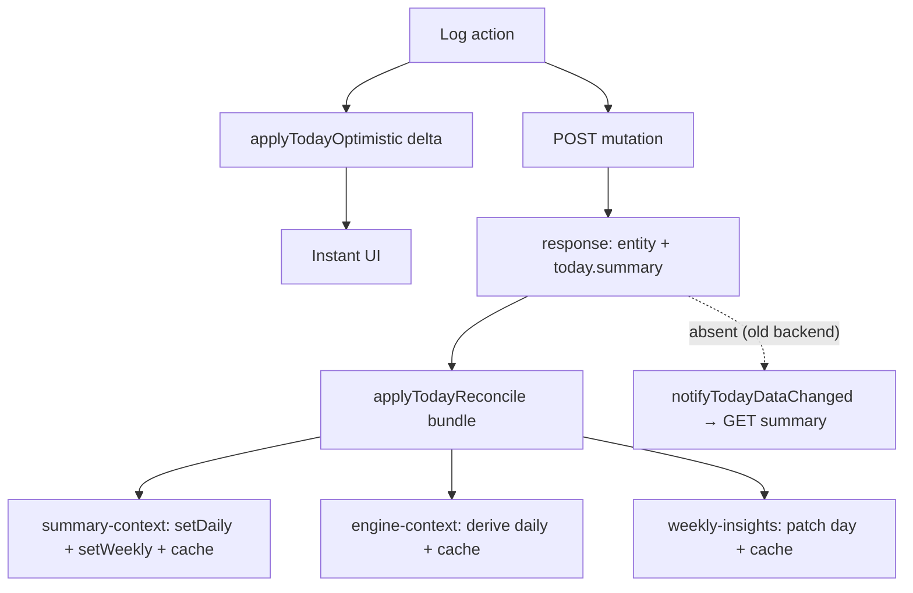

# Mutation response write-through plan

Eliminate the per-log `GET /summary/daily` (and the wider refetch cascade) by having today-mutating write endpoints **return the recomputed daily summary**, and having the client **write that response straight into state + cache**. Keep the optimistic delta for instant UI; reconcile from the POST response instead of a follow-up GET.

This is a follow-on to [`cache-consolidation-plan.md`](./cache-consolidation-plan.md). That plan unified the cache layer and invalidation map; this one removes the redundant read that every mutation currently triggers.

## Why

Today every log does two network things:

1. **Optimistic patch** — `applyTodayOptimistic(delta)` updates the daily summary in memory for instant UI (`context/food-context.tsx`, `context/workout-context.tsx`).
2. **`notifyTodayDataChanged(domain)`** → the summary listener force-refetches `GET /summary/daily` to reconcile server-only fields (chiefly `met_targets`).

So a log costs **2 round-trips** (POST + GET). The POST already triggers a server-side recompute of the summary — the GET just goes back to read it. Returning it in the POST response collapses this to **1 round-trip**, keeps `met_targets` authoritative immediately, and lets a single payload update every today-context.

Observed symptom this fixes (from request logs):

```
POST /api/water            201
GET  /api/summary/daily    200   ← redundant
POST /api/food/log         201
GET  /api/summary/daily    200   ← redundant
```

## Target end state



- Today-mutating writes return a `today` reconciliation block.
- Client reconciles from that block via a new `today-reconcile` channel.
- The `GET /summary/daily`-per-log refetch is removed.
- `notifyTodayDataChanged` shrinks to cross-cutting recomputes the response does **not** carry (e.g. `recovery` after a check-in).
- Backward-compatible: missing `today` block → fall back to the legacy refetch.

---

## Backend contract

### Response envelope

Every endpoint that mutates **today's** (or any single day's) aggregate returns its existing entity key **plus** a `today` block:

```jsonc
{
  "meal": { /* existing entity, unchanged */ },

  "today": {
    "date": "2026-06-05",        // the date recomputed — NOT always today (past-date edits)
    "summary": { /* DailySummary, shape below */ }
  }
}
```

The presence of `today` is the feature gate — no new endpoint, no version header.

### `today.summary` shape

Must match the client `DailySummary` (`context/summary-context.tsx:82`) field-for-field:

```jsonc
{
  "date":                "2026-06-05",
  "calorie_budget":      2200,
  "calories_consumed":   1450,
  "calories_burned":     320,
  "net_calories":        1130,
  "delta":               -750,            // consumed − budget
  "protein_consumed":    98,
  "carbs_consumed":      140,
  "fat_consumed":        44,
  "water_glasses":       5,
  "calorie_burn_source": "healthkit",     // "healthkit" | "checkin" | "baseline" | null
  "met_targets":         false
}
```

### Endpoint coverage

| Endpoint | Entity key (unchanged) | Returns `today.summary` |
|---|---|---|
| `POST /food/log` | `meal` | ✅ |
| `DELETE /food/log/:id` | `{ deleted }` | ✅ |
| `POST /workout` | `workout` | ✅ |
| `DELETE /workout/:id` | `{ deleted }` | ✅ |
| `POST /health/sync` | `health_data` | ✅ |
| `POST /water`, `DELETE /water/:id` | `data` | optional (water not shown in summary UI — may omit) |

---

## Phase 1 — Client reconcile channel ✅ Done

Add a sibling to `utils/today-optimistic.ts` that carries **authoritative server state** (not a delta) and is responsible for cache write-through.

### 1. `utils/today-reconcile.ts` ✅ (`TodayReconcileBundle`, `applyTodayReconcile`, `registerTodayReconcileListener`)

- `applyTodayReconcile(bundle: { date: string; summary: DailySummary })` — emitter.
- `registerTodayReconcileListener(fn)` — subscribe; returns unsubscribe.
- Same single-emitter / many-listener pattern as `today-optimistic`.

### Phase 1 done when

- Channel exists and is unit-tested (emit → listener receives bundle).
- No behavior change yet (nothing emits or listens in app code).

---

## Phase 2 — Context listeners (write-through) ✅ Done

Each today-context subscribes and writes **state + cache** from the one `summary`. All slices derive from the single payload — no extra network, no extra response fields.

### 2. summary-context ✅

- `setDaily(summary)`.
- If `date` falls in the current week: `setWeekly(prev => upsertTodayInWeekly(prev, summary))` (`summary-context.tsx:194` already exists).
- Write-through caches:
  - daily: `buildSummaryCacheKey(uid, date)`
  - weekly: `buildResourceKey('summary-weekly', uid, weekStart)`

### 3. engine-context ✅

- Derive from summary: `setDaily({ calorie_budget, calories_consumed, calories_burned, delta })` (today-only; `net_calories` not on `DailyEngine`).
- Write-through: `buildResourceKey('engine-daily', uid, date)`.

### 4. weekly insights (`hooks/use-weekly-insights.ts`) ✅

- Recompute today's `NormalizedDay` from `summary` via `recomputeNormalizedDay` (preserving steps/sleep), patch it into the cached week. Falls back to `setIsStale(true)` when a faithful local merge isn't possible (no week in memory, date out of window, or missing day slot).
- Write-through: `buildWeekKey(uid, week)`.

### Phase 2 done when

- Emitting a reconcile bundle updates daily + weekly + engine + insights in memory **and** their caches.
- A cold start immediately after a log reads the reconciled values (no stale flash).

---

## Phase 3 — Wire mutations + remove the refetch

### 5. Mutation contexts emit reconcile from the POST response ✅ Done

Implemented across `food-context`, `workout-context`, `health-context`, `water-context`. Each uses a small `extractTodayBundle(body)` guard (validates `body.today` has a string `date` + object `summary`) and, when present, calls `applyTodayReconcile(bundle)` after the success path. `applyTodayOptimistic(...)` and `notifyTodayDataChanged(...)` are left untouched — so this is a **no-op until the backend returns `today`**, and fully back-compat.

Wired paths: food `addMeal`/`analyzePhoto` (POST branch)/`logBarcode`/`deleteMeal`; workout `logWorkout`/`logSets`/`deleteWorkout`; health `saveHealthSnapshot` (inside the existing notify-gated block); water `logWater`/`deleteEntry`.

### 6. Trim `shouldRefetchSummaryAfterMutation` ✅ Done

`food`/`workout`/`health` removed from `shouldRefetchSummaryAfterMutation` (`cache-invalidation.ts`) — their reconcile blocks now cover the summary. Kept `summary`, `recovery`, `checkin` (checkin's endpoint does not yet return a reconcile block). `water` already removed.

> ⚠️ **Deploy order:** this trim relies on the backend returning `today`. Ship the backend (PR3) **before or with** this client. If the client ships first against an old backend, food/workout/health logs would not reconcile *and* not refetch → stale summary until the next natural fetch.

### Phase 3 done when

- [x] Client emits `applyTodayReconcile(body.today)` on every today-mutating write, guarded + back-compat. ✅
- [x] Backend (PR3) returns `today.summary` from food/workout/health write endpoints. ✅
- [x] Summary-refetch trimmed for those domains. ✅
- [ ] Verify on device: logging food/workout produces **no `GET /summary/daily`** in the server request log (rings/weekly still update instantly).

---

## Backend (PR3) — implemented

`roundfit-backend` (separate repo, `src/controllers/`):

- `summary.controller.ts` — added `getEnrichedDailySummary(userId, date)` (reads + enriches the daily_summary row, same shape as `GET /summary/daily`) and `buildTodayReconcile(userId, date)` (best-effort `{ date, summary }`, returns null on failure so the client falls back).
- `food.controller.ts` — `logFood`, `logFoodByPhoto`, `logFoodByBarcode`, `deleteFoodLog` attach `today` after their existing `upsertDailySummary`.
- `workouts.controller.ts` — `logWorkout`, `deleteWorkout` attach `today`.
- `health.controller.ts` — `syncHealthData` attaches `today` after `upsertDailySummary`.
- Water endpoints intentionally **not** changed (no summary UI consumer).
- `checkin` not yet changed — still uses the legacy summary refetch (kept in the trim list).

All `today` blocks are additive to the existing response (entity key unchanged), so old clients ignore them.

---

## Suggested PR order

1. **PR1** — `utils/today-reconcile.ts` + tests (Phase 1). No app wiring. Safe to merge alone.
2. **PR2** — context listeners write-through (Phase 2). Dormant until something emits.
3. **PR3 (backend)** — add `today.summary` to write responses.
4. **PR4** — mutation contexts emit reconcile + back-compat fallback (Phase 3.5).
5. **PR5** — trim `shouldRefetchSummaryAfterMutation` (Phase 3.6) once PR3 is live in prod.

Client (PR1–2, 4) and backend (PR3) can ship in either order — the fallback makes both directions safe.

## Edge cases

- **Past-date edits** — `today.date` reflects the edited day; client writes to that day's cache and only patches weekly if the date is in the current week. (Field is `date`, not `today`, for exactly this.)
- **Failed mutation** — no `today` block on 4xx/5xx → roll back the optimistic delta (already done) and stop.
- **Old backend / phased rollout** — `today` absent → legacy refetch. Backward-compatible.
- **Concurrency** — returned summary reflects *this* write only; another device's concurrent write still converges via the 2h cache / foreground reconcile. Unchanged from today.

## Verification checklist

- [ ] Log food → 1 request (`POST /food/log`), no `GET /summary/daily`; daily + weekly + rings update instantly.
- [ ] `met_targets`-driven consistency UI (`app/(tabs)/progress/index.tsx:123`) is correct immediately after a log, with no refetch.
- [ ] Cold start right after a log shows reconciled values (cache write-through works).
- [ ] Backend flag off → identical to current behavior (fallback refetch fires).
- [ ] Past-date edit reconciles the correct day, not today.
- [ ] Rapid multi-log (4 foods) → 4 POSTs, 0 summary GETs.

## Rough effort

- Phase 1: ~0.5 day (channel + tests).
- Phase 2: ~1 day (3 context listeners + cache write-through).
- Phase 3: ~0.5 day client + backend response work (backend owns the recompute, which already exists).

## Related code today

- Optimistic channel: `utils/today-optimistic.ts` (`applyTodayOptimistic`, `registerTodayOptimisticListener`).
- Sync/notify bus: `utils/today-sync.ts` (`notifyTodayDataChanged`), decisions in `utils/cache-invalidation.ts`.
- Daily summary: `context/summary-context.tsx` (`DailySummary`, `patchDailyRow`, `upsertTodayInWeekly`, `loadTodayDaily`).
- Caches: `utils/resource-cache.ts`, `utils/daily-summary-cache.ts`, `utils/insights-cache.ts`.
- Aggregator: `utils/insights-aggregator.ts` (`recomputeNormalizedDay`).
- Mutations: `context/food-context.tsx`, `context/workout-context.tsx`, `context/water-context.tsx`, `context/health-context.tsx`.

## What not to do

- Don't return engine/insights blocks separately — they derive from the one `summary`. Extra blocks = extra coupling for no gain.
- Don't drop the optimistic delta — it provides the 0ms feel before the POST returns.
- Don't remove `notifyTodayDataChanged` wholesale — recovery/check-in still need it for aggregates the response doesn't carry.
