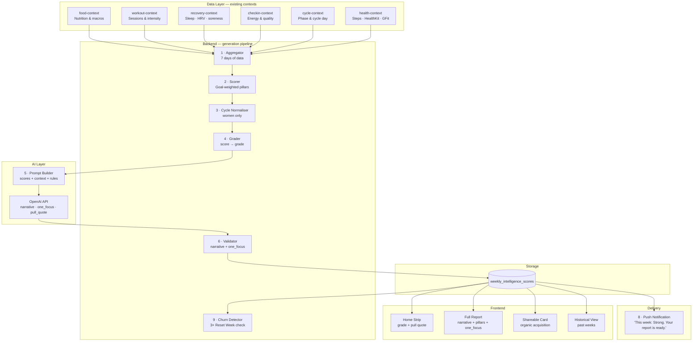
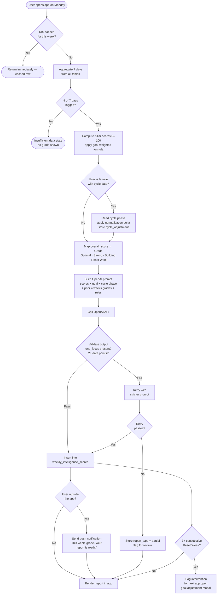
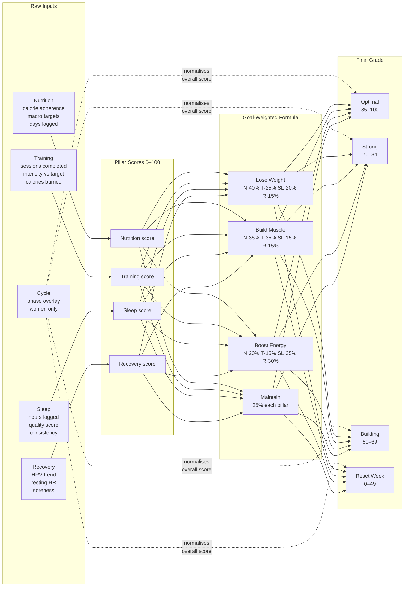
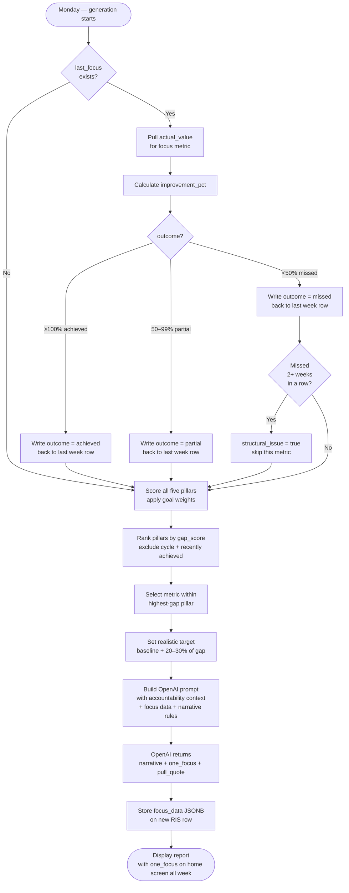

# RoundFit Intelligence Score (RIS™)
## Architecture & Product Specification

---

## What It Is

The RoundFit Intelligence Score is a weekly personalised health intelligence report delivered every Monday morning. It combines five pillars of a user's week — nutrition consistency, sleep quality, recovery trend, training balance, and cycle patterns — and expresses them as a directional grade with a natural language narrative generated specifically from that user's own data.

No other app generates a personalised weekly health grade with a natural language narrative built from the user's own data. Charts exist everywhere. A personalised written report card does not.

---

## The Grade System

Grades are directional and coaching-oriented — never judgemental.

| Grade | Score Range | What It Means |
|---|---|---|
| **Optimal** | 85–100 | Executed the strategy near-perfectly |
| **Strong** | 70–84 | Solid week, minor gaps |
| **Building** | 50–69 | On track but room to improve |
| **Reset Week** | 0–49 | Low output — cycle or life context noted |

There are no A/B/C grades. A "Reset Week" is not a failure — it is a coaching signal with context.

---

## The Five Pillars

Every RIS is built from five scored pillars. Each pillar has a score (0–100) and its own directional grade.

| Pillar | What It Measures |
|---|---|
| **Nutrition** | Calorie adherence, macro targets hit, days logged |
| **Training** | Sessions completed, intensity, consistency vs target |
| **Sleep** | Hours logged, quality scores, consistency across the week |
| **Recovery** | HRV trend, resting heart rate, soreness levels |
| **Cycle** | Phase context, energy-adjusted expectations (women only) |

The Cycle pillar is an overlay — it normalises the other four scores rather than competing with them for weight. It is omitted entirely for male users.

---

## Goal-Relative Grading

The grade reflects "how well did you execute your strategy this week" — not a universal fitness standard. The same data produces a different grade depending on the user's goal. Pillar weights shift accordingly:

| Pillar | Lose Weight | Build Muscle | Boost Energy | Maintain |
|---|---|---|---|---|
| Nutrition | 40% | 35% | 20% | 25% |
| Training | 25% | 35% | 15% | 25% |
| Sleep | 20% | 15% | 35% | 25% |
| Recovery | 15% | 15% | 30% | 25% |

A skipped workout on a deficit week is different from a skipped workout on a muscle-building week. The grade reflects that difference.

---

## Cycle Normalisation

The luteal phase (days 15–28) biologically suppresses energy, elevates soreness, and disrupts sleep. A woman who gets a low grade every third week because of her biology — not her behaviour — will churn.

**How it works:**
- The user's current cycle phase is read from `cycle-context` at generation time
- If in the luteal phase → an upward adjustment is applied to `overall_score`
- If in the follicular phase → the narrative flags this as a peak energy window and challenges the user to push harder
- The adjustment is **visible**, not silent — a *Cycle-adjusted* badge appears next to the grade
- The narrative explicitly names the phase: *"Your luteal phase biologically suppresses energy and elevates soreness — this week's grade reflects your effort, not the biology working against you."*

That sentence is the difference between a woman churning and feeling genuinely understood by the app.

---

## The Narrative

The narrative is the core product. It is generated by the OpenAI API using the user's actual data for that week — not a template with fill-in-the-blank numbers.

**Rules enforced in the generation prompt:**
1. Reference at least two specific data points from the user's actual week
2. Acknowledge cycle phase if applicable
3. Do not summarise charts — interpret patterns
4. Always close with exactly one forward-looking focus sentence — never a list, actionable within 7 days

**The one focus:**
Every report ends with a single sentence. Not three things. One.

> *"Your one focus this week: protect your sleep window before midnight."*

Users remember one thing. This is what makes the app feel like a coach, not a dashboard. The focus must always be forward-looking (about the coming week) and actionable within 7 days.

---

## Delivery

**Timing:** Monday morning, lazy generation on app open.

This is timezone-safe — a user in Lagos and a user in LA both get their report when *they* open the app Monday morning. No cron job, no batch processing by timezone.

**Push notification copy:**
> *"This week: Strong. Your report is ready."*

The grade is in the notification. The user knows their score before opening the app and opens it to understand why. That is the correct motivation loop. Note: "one word" framing breaks for "Reset Week" — the copy uses "This week: [grade]." which works for all four directional grades.

**Data threshold:** A minimum of 4 out of 7 days with meaningful data is required before a final report generates. Below the threshold, the app shows an insufficient-data state — it does not generate a low-quality grade from incomplete information.

---

## Architecture

### System Overview



---

### Generation Pipeline



---

### Pillar Scoring & Grading



---

### Data Layer (already exists)

RoundFit already collects everything RIS needs. No new data collection is required.

```
food-context        → daily calorie / macro adherence
workout-context     → sessions, intensity, duration, calories burned
recovery-context    → sleep hours, HRV, soreness, resting heart rate
checkin-context     → morning energy level, sleep quality rating
cycle-context       → current phase, cycle day
health-context      → steps, active calories (HealthKit / Google Fit)
```

### Generation Pipeline

When a user opens the app on Monday and no RIS exists for the current week, the server runs this sequence:

```
1. AGGREGATE
   Pull 7 days of data from all relevant tables for this user.
   Check data threshold — fewer than 4/7 days logged → return
   insufficient state, do not generate.

2. SCORE
   Compute raw pillar scores (0–100 each).
   Apply goal-weighted formula to produce overall_score.
   The goal captured at generation time is stored — not re-read
   from the profile — because the user's goal can change.

3. CYCLE NORMALISE (women only)
   Read current cycle phase from cycle-context.
   Luteal  → apply upward score adjustment, flag cycle_normalized = true.
   Follicular → flag in narrative as peak window, no score adjustment.
   Store: cycle_phase, cycle_normalized, cycle_adjustment (delta applied).

4. GRADE
   Map overall_score to directional grade:
   85–100 → Optimal
   70–84  → Strong
   50–69  → Building
   0–49   → Reset Week

5. BUILD PROMPT → CALL OPENAI API
   Send structured JSON payload containing:
   - All five pillar scores and their raw inputs
   - User goal, name, cycle phase
   - Prior 4 weeks grades (oldest → newest)
   - Strict narrative rules (see above)
   OpenAI returns: narrative, one_focus, pull_quote.

6. VALIDATE
   Confirm one_focus is present and is a single sentence.
   Confirm narrative references at least 2 specific data points.
   If validation fails → retry once with a stricter prompt.
   If retry fails → store with is_partial = true and flag for review.

7. STORE
   Insert row into weekly_intelligence_scores.
   Columns written: grade, overall_score, goal_at_generation,
   pillar_scores (JSONB), cycle_phase, cycle_normalized,
   cycle_adjustment, narrative, one_focus, pull_quote,
   prior_grades, model_version, input_snapshot, generated_at.

8. PUSH NOTIFICATION
   If user is NOT currently active in the app → send push notification.
   Copy: "This week: [grade]. Your report is ready."
   Works for all four directional grades including "Reset Week".

9. CHURN DETECTION
   After insert, query the last 4 weeks of grades for this user.
   If 3 or more consecutive Reset Week grades are found →
   trigger intervention flow on next app open:
   "The last few weeks have been tough. Want to adjust your goal?"
   This is a check-in modal, not another report card.
```

### Full Flow

```
Week Mon–Sun
User logs food, workouts, sleep, check-ins, cycle data
                        ↓
Monday — user opens app → GET /ris/current-week
                        ↓
             Cached final result exists?
             ┌──────────┴──────────┐
            Yes                   No
             ↓                     ↓
        Return immediately     Run generation pipeline
                                    ↓
                          Aggregate → Score → Normalise
                                    ↓
                            OpenAI API → Validate
                                    ↓
                       Store in weekly_intelligence_scores
                                    ↓
                      Push notification (if not in app)
                                    ↓
                         Render report in app
                                    ↓
                  Post-insert: check for 3x Reset Week
                                    ↓
                     Intervention flow if triggered
```

### Mid-Week Preview (Partial Report)

Same pipeline. Lower data threshold (3/7 days). `report_type = 'partial'`. User can tap "See how your week is tracking" from the home screen on Wednesday or Thursday.

The partial report explicitly labels itself a preview — it is not the final grade. The final report generated Monday overwrites it in the UI.

---

## The Focus Loop — Coaching Accountability Algorithm

The focus is not a suggestion. It is a **tracked commitment**. Every Monday, before the new report generates, the algorithm checks whether the user actually moved the metric from last week. The new narrative opens by answering that question — then picks the next focus based on what it finds.

This closed loop is what makes RIS feel like a coach and not a dashboard. The report tells you what to do. The algorithm remembers. Next week, it checks.

```
Week 1 Monday
  Generate RIS → score pillars → select focus metric
  Store: focus_data { pillar, metric, baseline, target }
  Display: "Your one focus: average 6.5h sleep this week."
                    ↓
          User sees it on home screen all week
                    ↓
Week 2 Monday — BEFORE scoring begins
  Pull avg_sleep_hours for past 7 days → 6.7h
  Outcome: achieved  (6.7 ≥ 6.5 target)
  Write outcome back to Week 1 row
                    ↓
  Generate Week 2 RIS
  Narrative opens: "Last week you focused on sleep —
  you averaged 6.7 hours, up from 5.8. That's real.
  Your recovery score moved with it."
                    ↓
  Pick next focus: training sessions (now the biggest gap)
  Display: "Your one focus: complete 3 training sessions this week."
```

---

### Why the Focus Must Be Structured, Not Just Text

A text sentence like *"protect your sleep window"* cannot be checked algorithmically. The focus needs a machine-readable form underneath the human-readable display sentence.

```jsonc
{
  "pillar":         "sleep",
  "metric":         "avg_sleep_hours",
  "direction":      "increase",
  "baseline":       5.8,        // what they averaged this past week
  "target":         6.5,        // what the algorithm is asking for next week
  "outcome":        null,       // filled in when next week's report generates
  "outcome_value":  null        // the actual value achieved
}
```

Next Monday the algorithm pulls `avg_sleep_hours` for the past 7 days and compares it to `6.5`. The outcome is measurable, not interpretive.

---

### Focus Selection Algorithm

Runs at step 5 of the generation pipeline, after all five pillars are scored.

```
INPUT:  pillar_scores    — this week's five scored pillars with raw metrics
        last_focus       — the focus_data object from last week's RIS (may be null)
        prior_focuses    — last 4 weeks of focus records (to avoid cycling)
        user_goal        — lose | muscle | energy | maintain
        cycle_phase      — for women, to exclude cycle-driven lows

────────────────────────────────────────────────────────────────

STEP 1 — CHECK LAST WEEK'S FOCUS OUTCOME

  If last_focus exists:

    Pull actual_value for last_focus.metric from this week's aggregated data

    improvement_pct = (actual_value − baseline) / (target − baseline) × 100

    ≥ 100%  → outcome = "achieved"
     50–99% → outcome = "partial"
    < 50%   → outcome = "missed"

    Write outcome + outcome_value back onto the previous week's RIS row.

    If outcome = "missed" AND prev_week outcome was also "missed":
      → same metric missed 2 consecutive weeks
      → flag structural_issue = true
      → do NOT select the same focus again this week
      → if 3+ consecutive misses → trigger goal adjustment intervention

────────────────────────────────────────────────────────────────

STEP 2 — RANK PILLARS BY OPPORTUNITY

  For each pillar:
    gap_score = (100 − pillar_score) × goal_weight_for_this_pillar

  Sort pillars by gap_score descending.

  Exclude:
    — Cycle pillar entirely (biological, not behavioural)
    — Any pillar where last_focus outcome = "achieved" this week
      (already improved — don't immediately repeat it)
    — Any pillar that appeared in prior_focuses 3+ of the last 4 weeks
      (prevents fixating on one area indefinitely)

  Top remaining pillar = focus_pillar for this week.

────────────────────────────────────────────────────────────────

STEP 3 — SELECT THE SPECIFIC METRIC WITHIN THE PILLAR

  Nutrition:
    days_logged < 5/7            → metric: days_logged,       target: 6
                                   (logging comes first — can't score what isn't logged)
    protein_adherence < 70%      → metric: protein_adherence, target: 85%
    avg_calorie_delta > 400      → metric: avg_calorie_delta,  target: < 200

  Sleep:
    avg_sleep_hours < 6.5        → metric: avg_sleep_hours,   target: 7.0
    sleep_consistency < 60%      → metric: sleep_consistency, target: 80%
                                   (consistency = nights within ±30 min of same bedtime)

  Training:
    sessions < weekly_target     → metric: sessions_completed, target: +1 session
    all sessions light intensity → metric: moderate_sessions,  target: 1 moderate session

  Recovery:
    hrv_trend declining          → metric: rest_days,         target: +1 rest day
    avg_soreness > 7/10          → metric: avg_soreness,      target: ≤ 5/10

────────────────────────────────────────────────────────────────

STEP 4 — SET A REALISTIC TARGET

  Target = baseline + 20–30% of the gap to ideal.
  Never a moonshot. Must be achievable in 7 days.

  Example:
    avg_sleep_hours baseline = 5.8,  ideal = 8.0
    gap              = 8.0 − 5.8   = 2.2 hours
    20% of gap       = 0.44
    target           = 5.8 + 0.44  = 6.24 → round to 6.5

  The user never feels set up to fail.

────────────────────────────────────────────────────────────────

STEP 5 — FORMAT THE FOCUS DISPLAY

  Pass focus_pillar, focus_metric, baseline, and target to the OpenAI API.
  OpenAI writes the one_focus display sentence.

  Prompt rules enforced:
    — Forward-looking only (about the coming week, never the past)
    — Specific and numerical where possible
    — Actionable within 7 days
    — Exactly one sentence. No list.
```

---

### Accountability Check Algorithm

Runs at the **very start** of the Week N+1 generation pipeline, before any scoring begins.

```
INPUT:  last_week_focus   — the structured focus_data object from last week
        this_week_data    — raw aggregated data for the past 7 days

────────────────────────────────────────────────────────────────

actual_value    = aggregate(this_week_data, last_week_focus.metric)
improvement_pct = (actual_value − baseline) / (target − baseline) × 100

Outcome:
  ≥ 100%  → achieved  — hit or exceeded the target
   50–99% → partial   — meaningful progress, short of target
  < 50%   → missed    — little to no movement

────────────────────────────────────────────────────────────────

BUILD ACCOUNTABILITY CONTEXT passed to OpenAI prompt:

  achieved →
    "The user's focus last week was [focus_display].
     They achieved it: [actual_value] vs target [target].
     Open the narrative by acknowledging this specifically —
     name the number, name what shifted. Genuine recognition,
     not a generic 'great job.'"

  partial →
    "The user's focus last week was [focus_display].
     They made real progress: [actual_value] vs target [target]
     (up from baseline [baseline]).
     Acknowledge the movement without framing the gap as failure.
     Decide whether to extend this focus or move on."

  missed →
    "The user's focus last week was [focus_display].
     The metric did not move: [actual_value] vs target [target].
     Do NOT frame this as failure. Look at the rest of the data
     for a structural reason — high soreness? late energy on
     check-ins? cycle phase? unusual training load?
     Explain what likely got in the way, then set the next focus."

────────────────────────────────────────────────────────────────

CONSECUTIVE MISS LOGIC:

  If outcome = "missed" for 2+ consecutive weeks on the same metric:
    → set structural_issue = true on this week's row
    → do not repeat the same focus
    → if 3+ weeks: queue goal adjustment intervention modal
```

---

### Focus Loop Flowchart



---

### Focus Metric Reference

| Pillar | Condition | Metric | Target Logic |
|---|---|---|---|
| Nutrition | days_logged < 5 | `days_logged` | +1 day |
| Nutrition | protein < 70% | `protein_adherence` | +15 percentage points |
| Nutrition | calorie delta > 400 | `avg_calorie_delta` | halve the delta |
| Sleep | avg hours < 6.5 | `avg_sleep_hours` | baseline + 20% of gap to 8h |
| Sleep | inconsistent bedtime | `sleep_consistency` | +20 percentage points |
| Training | sessions < target | `sessions_completed` | +1 session |
| Training | all sessions light | `moderate_sessions` | 1 moderate session |
| Recovery | HRV declining | `rest_days` | +1 rest day |
| Recovery | soreness > 7 | `avg_soreness` | ≤ 5/10 |

---

## Database Schema

```sql
create type ris_grade as enum (
  'Optimal', 'Strong', 'Building', 'Reset Week'
);

create type ris_goal as enum (
  'lose', 'muscle', 'energy', 'maintain'
);

create table weekly_intelligence_scores (
  id                  uuid          primary key default gen_random_uuid(),
  user_id             uuid          not null references auth.users(id) on delete cascade,

  week_start          date          not null,
  week_end            date          not null generated always as (week_start + interval '6 days') stored,

  grade               ris_grade     not null,
  overall_score       numeric(5,2)  not null check (overall_score between 0 and 100),
  goal_at_generation  ris_goal      not null,

  -- Per-pillar breakdown
  -- Shape: { "nutrition": { "score": 82, "grade": "Strong", "days_logged": 6 }, ... }
  pillar_scores       jsonb         not null default '{}',

  -- Cycle normalisation (women only)
  cycle_phase         text,
  cycle_normalized    boolean       not null default false,
  cycle_adjustment    numeric(5,2),

  -- AI-generated content
  narrative           text          not null,
  one_focus           text          not null,  -- human-readable display sentence
  pull_quote          text,

  -- Structured focus data (machine-readable — drives next week's accountability check)
  -- Shape: {
  --   "pillar":        "sleep",
  --   "metric":        "avg_sleep_hours",
  --   "direction":     "increase",
  --   "baseline":      5.8,
  --   "target":        6.5,
  --   "outcome":       null,        ← written by next week's pipeline
  --   "outcome_value": null         ← written by next week's pipeline
  -- }
  focus_data          jsonb         not null default '{}',

  -- True when the same focus metric was missed 2+ consecutive weeks
  structural_issue    boolean       not null default false,

  -- Trend context passed to OpenAI at generation time
  prior_grades        jsonb,        -- ["Building", "Strong", "Strong", "Optimal"]

  -- Generation metadata
  report_type         text          not null default 'final'
                        check (report_type in ('partial', 'final')),
  model_version       text          not null default 'ris-v1',
  input_snapshot      jsonb,
  generated_at        timestamptz   not null default now(),

  constraint uq_ris_user_week_type unique (user_id, week_start, report_type),
  constraint ck_ris_week_start_is_monday check (extract(dow from week_start) = 1)
);

create index idx_ris_user_week        on weekly_intelligence_scores (user_id, week_start desc);
create index idx_ris_grade            on weekly_intelligence_scores (grade);
create index idx_ris_goal             on weekly_intelligence_scores (goal_at_generation);
create index idx_ris_cycle_phase      on weekly_intelligence_scores (cycle_phase) where cycle_phase is not null;
create index idx_ris_structural_issue on weekly_intelligence_scores (user_id) where structural_issue = true;

alter table weekly_intelligence_scores enable row level security;

create policy "Users read own scores"
  on weekly_intelligence_scores for select
  using (auth.uid() = user_id);

create policy "Service role full access"
  on weekly_intelligence_scores for all
  using (auth.role() = 'service_role');
```

---

## Frontend Surfaces

### 1. Home Screen Strip
Appears Monday morning once the report is ready. Shows grade label + pull quote. Tappable to the full report view.

### 2. Full Report View
- Grade badge (with Cycle-adjusted tag if applicable — always visible, never silent)
- Five pillar cards with individual scores and directional grades (Optimal / Strong / Building / Reset Week)
- Full narrative text
- `one_focus` sentence highlighted prominently at the bottom — forward-looking, actionable within 7 days
- Trend bar showing last 4 weeks of grades

### 3. Shareable Card
Grade + pull quote rendered as a static image. One tap to share to Instagram, WhatsApp, etc. This is the organic acquisition surface — designed deliberately.

### 4. Historical View
Scrollable list of past weekly reports. Each row shows week, grade, and one_focus. Tap to read the full narrative for any past week.

---

## Churn Prevention Logic

| Condition | Trigger | Response |
|---|---|---|
| 3+ consecutive Reset Week | Post-insert check | Goal adjustment modal on next open |
| Below data threshold | Generation check | Gentle nudge to log more, no grade shown |
| Mid-week low trajectory | Partial report | Forward-looking coaching note, not a warning |

---

## API Endpoints

| Method | Path | Purpose |
|---|---|---|
| `GET` | `/ris/current-week` | Returns cached RIS or triggers generation |
| `GET` | `/ris/history` | Returns all past weekly scores for the user |
| `POST` | `/ris/preview` | Triggers a mid-week partial report |
| `GET` | `/ris/:week_start` | Returns a specific week's report |

---

## Key Design Decisions

**Why lazy generation and not a cron job?**
Cron jobs require batching by user timezone. Lazy generation means every user gets their report when they open the app — which is timezone-safe and only consumes an API call when there is a real user waiting for the result.

**Why store `goal_at_generation` instead of reading the current goal?**
The user's goal can change. The grade should reflect what they were trying to do that week, not what they decided afterward. Historical reports stay interpretable.

**Why is `one_focus` a non-null database column?**
Enforcing it at the schema level means the application can never accidentally render a report without a focus. The constraint is structural, not just a prompt instruction.

**Why is the cycle adjustment visible?**
Silently boosting the score undermines trust. A user who sees "Cycle-adjusted" next to their grade understands why some weeks feel harder. Transparency is the feature.

**Why `model_version`?**
When the generation prompt is updated, older narratives become stale. `model_version` lets the app identify which reports were generated under which logic — enabling targeted regeneration without touching all historical data.

---

## Implementation TODO

Ordered by dependency — nothing in a later phase should be started before the phase above it is complete and tested.

---

### Phase 1 — Database

- [ ] Run `weekly_intelligence_scores` migration in Supabase
- [ ] Confirm RLS policies are active (users read own rows, service role full access)
- [ ] Confirm `ris_grade` and `ris_goal` enums created correctly
- [ ] Verify `ck_ris_week_start_is_monday` constraint and all indexes

---

### Phase 2 — Backend: Data Aggregation

- [ ] Build `aggregateWeekForUser(userId, weekStart)` — pulls 7 days of data from all tables:
  - food logs (calories, macros, days logged)
  - workouts (sessions, intensity, duration)
  - recovery logs (sleep hours, sleep score, HRV, RHR, soreness)
  - checkins (energy level, sleep quality rating)
  - cycle data (phase, cycle day)
- [ ] Implement data threshold check — fewer than 4/7 days with meaningful data → return `{ insufficient: true }`
- [ ] Store `goal_at_generation` from the user's profile at aggregation time (not re-read later)

---

### Phase 3 — Backend: Scoring

- [ ] Build `computeRisPillarScores(aggregated)` — returns 0–100 for each pillar:
  - Nutrition: calorie adherence + macro targets hit + days logged
  - Training: sessions completed + intensity + consistency vs target
  - Sleep: hours + quality score + consistency across the week
  - Recovery: HRV trend + RHR trend + soreness average
- [ ] Build `applyGoalWeights(pillarScores, goal)` — applies the 4-goal weight table to produce `overall_score`
- [ ] Build `applyCycleNormalisation(overallScore, cyclePhase)` — luteal phase upward adjustment, returns `{ adjusted_score, cycle_adjustment, cycle_normalized }`
- [ ] Build `mapScoreToGrade(score)` — 85–100 Optimal, 70–84 Strong, 50–69 Building, 0–49 Reset Week

---

### Phase 4 — Backend: Focus Accountability

- [ ] Build `checkLastWeekFocus(userId, thisWeekAggregated)`:
  - Pull last week's `focus_data` from `weekly_intelligence_scores`
  - Pull `actual_value` for the focus metric from aggregated data
  - Calculate `improvement_pct` and classify as achieved / partial / missed
  - Write outcome + outcome_value back onto last week's row
  - Detect 2+ consecutive misses on same metric → set `structural_issue = true`
  - Detect 3+ consecutive misses → queue goal adjustment intervention
- [ ] Build `selectFocusForWeek(pillarScores, goal, lastFocus, priorFocuses, cyclePhase)`:
  - Rank pillars by `gap_score = (100 - score) × goal_weight`
  - Exclude cycle pillar, recently achieved pillars, pillars repeated 3+ of last 4 weeks
  - Select specific metric within top pillar using the metric selection rules
  - Set realistic target: baseline + 20–30% of gap to ideal

---

### Phase 5 — Backend: OpenAI Generation

- [ ] Build `buildRisPrompt(context)` — structured prompt containing:
  - All five pillar scores and their raw inputs
  - User first name, goal, cycle phase
  - Prior 4 weeks grades (oldest → newest)
  - Accountability context (last focus outcome — achieved / partial / missed with actual value)
  - Focus data for this week (pillar, metric, baseline, target)
  - Strict narrative rules enforced in the prompt
- [ ] Call OpenAI API with `response_format: { type: "json_object" }` — expect `{ narrative, one_focus, pull_quote }`
- [ ] Build `validateRisOutput(output)`:
  - `one_focus` is present and is a single sentence
  - `narrative` references at least 2 specific data points
  - If validation fails → retry once with stricter prompt
  - If retry fails → store with `report_type = 'partial'`

---

### Phase 6 — Backend: API Endpoints

- [ ] `GET /ris/current-week` — full lazy generation endpoint:
  - Check cache → return immediately if final report exists for this week
  - Run phases 2–5 if not cached
  - Store result in `weekly_intelligence_scores`
  - Trigger push notification if user is not active in app
  - Run post-insert churn check (3+ consecutive Reset Week → flag intervention)
- [ ] `GET /ris/history` — returns all past weekly scores for the user (grade, one_focus, week_start per row)
- [ ] `GET /ris/:week_start` — returns full report for a specific week
- [ ] `POST /ris/preview` — mid-week partial report (threshold 3/7 days, `report_type = 'partial'`)

---

### Phase 7 — Frontend: Context & Hook

- [ ] Create `ris-context.tsx` — fetches and caches current week's RIS on app load
- [ ] Expose `useRis()` hook returning: `{ report, isLoading, isInsufficient, refresh }`
- [ ] Handle insufficient data state (< 4/7 days) — show progress nudge, not an empty screen

---

### Phase 8 — Frontend: Home Screen Strip

- [ ] Add RIS strip to home screen — appears Monday morning once report is ready
- [ ] Shows: grade label + pull quote, tappable to full report
- [ ] Shows mid-week nudge ("4 days logged — keep going") if no report yet
- [ ] Disappears or collapses after user views the full report

---

### Phase 9 — Frontend: Full Report Screen

- [ ] Grade badge (Optimal / Strong / Building / Reset Week) — correct colour per grade
- [ ] Cycle-adjusted badge alongside grade if `cycle_normalized = true` — always visible, never hidden
- [ ] Five pillar cards with individual scores and directional grade labels
- [ ] Full narrative text block
- [ ] `one_focus` sentence displayed prominently at the bottom — styled as a forward-looking callout
- [ ] Last 4 weeks trend bar (grade history)
- [ ] Loading state while generation runs
- [ ] Insufficient data state with logging progress

---

### Phase 10 — Frontend: History View

- [ ] Scrollable list of past weekly reports
- [ ] Each row: week date range, grade badge, one_focus sentence
- [ ] Tap any row to open the full report for that week

---

### Phase 11 — Frontend: Shareable Card

- [ ] Render grade + pull quote as a static shareable image
- [ ] One-tap share to Instagram, WhatsApp, etc.
- [ ] RoundFit branding on the card

---

### Phase 12 — Polish & Edge Cases

- [ ] Push notification wired up: `"This week: [grade]. Your report is ready."`
- [ ] Goal adjustment intervention modal (3+ consecutive Reset Week)
- [ ] Partial report clearly labelled as a preview — not a final grade
- [ ] `model_version` bumped whenever the generation prompt changes
- [ ] Handle OpenAI API timeout / failure gracefully — surface error state, retry on next open
