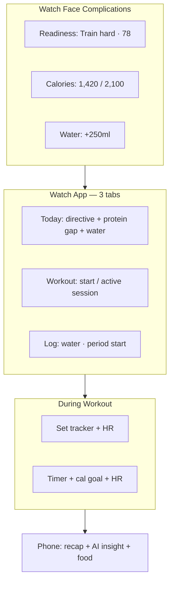

# Apple Watch — v1 Product Spec

> **Status:** Planning only — no code yet.
>
> **Vision:** The phone is the dashboard and deep log. The watch is the
> in-the-moment coach — glanceable before a workout, actionable during one, and
> frictionless for the few things people actually do on their wrist.
>
> **The one test for every watch feature:**
> *Does this tell the user what to do, or just show them data?* If the latter,
> it belongs on the phone.

This doc defines what data RoundFit should display on Apple Watch, what actions
users can take from the wrist, and what stays phone-only. Grounded in existing
app data (readiness, nutrition, workouts, cycle, check-in, HealthKit sync) and
the AI coach direction in `docs/AI_COACH_CURRENT_STATE.md`.

---

## Snapshot

| Tier | Feature | Surface | Priority |
|------|---------|---------|----------|
| 1 | Today's directive (readiness) | Complication + app home | Must-have |
| 1 | Active workout (set tracker / cardio) | Full-screen session | Must-have |
| 1 | Water quick-add | Complication + log tab | Must-have |
| 2 | Calorie budget glance | Complication + today tab | High value |
| 2 | Cycle glance + period log | Today tab (opt-in) | High value |
| 2 | Post-workout confirm | Notification / action | High value |
| 3 | Daily AI insight (1 line) | Complication | Later |
| 3 | Steps / move ring | Complication | Later |
| — | Daily check-in, food search, charts, profile, onboarding | — | Phone-only |

Legend: Tier 1 = v1 ship · Tier 2 = v1.5 · Tier 3 = v2+

---

## Existing foundation (phone app today)

RoundFit already has the data and plumbing a watch build would extend:

- **HealthKit sync** — steps, calories, sleep stages, heart rate, HRV, resting
  HR, VO2 max, exercise minutes; Watch is often the write source.
- **Workout import** — native Watch workouts detected and imported via
  `services/workout-import.ts` (`isFromWatch` source detection).
- **Live Activity** — `WorkoutActivityAttributes` and `WorkoutSessionAttributes`
  already mirror session state on lock screen / Dynamic Island: calories, HR,
  set count, last exercise, reps, weight, volume.
- **Readiness engine** — 6-pillar score → `Rest` / `Light workout` / `Moderate`
  / `Train hard` + reason + tips (`utils/readiness.ts`, `use-home-readiness.ts`).
- **Check-in** — subjective energy, soreness, sleep feel (`CheckinModal.tsx`).
  Phone-only; not logged from the watch.
- **Nutrition** — calorie budget, macros, remaining protein (`summary-context`).
- **Cycle** — phase, cycle day, period logging, predictions (in progress).
- **Water** — daily total vs goal.

The watch should **extend** this loop, not duplicate the home screen.

---

## Watch role vs phone

| Phone | Watch |
|-------|-------|
| Full dashboard (calories, macros, meals, workouts, hydration) | One directive at a time |
| Food search, photo, barcode, manual entry | Water quick-add only |
| Daily check-in (energy, soreness, sleep feel) | — |
| Cycle calendar, history, metrics | Phase label + log period start |
| Readiness detail (6 factors, trends, tips list) | Headline + score + one reason |
| AI insight paragraphs, weekly debrief, charts | Optional 1-line truncation |
| Profile, targets, settings, export | None |
| Workout library, set editing, recap sheets | Active session + end/confirm |

---

## Tier 1 — Must-have (v1)

### 1. Today's directive

**What to show**

| Surface | Primary | Secondary |
|---------|---------|-----------|
| Complication | Readiness recommendation | Score (e.g. 72) or limiting factor |
| App home (Today tab) | Same headline | One reason line ("low sleep") |
| Tap | Deep link to phone → full readiness + tips | — |

**What not to show:** all 6 readiness factors, trend charts, full tips list.

Maps to the strongest coaching pillar (workout recommendations). The watch
answers: *"What should I do today?"* in one glance. Readiness may use check-in
data when available on phone; the watch does not collect check-in itself.

---

### 2. Active workout

The primary reason users open a fitness app on their wrist.

**Strength session**

| Display | Actions |
|---------|---------|
| Current exercise name | Log set (preset from last set) |
| Last set: `8 × 60 kg` | Next exercise |
| Set count + session timer | End workout |
| HR + calories (Watch sensors) | Pause / resume |

**Cardio / burn session**

| Display | Actions |
|---------|---------|
| Elapsed time | Pause / resume |
| Calories vs goal | End workout |
| HR zone indicator | — |

Extends existing Live Activity fields (`WorkoutSessionAttributes`: set count,
last exercise, reps, weight, volume, calories, HR). Phone handles recap sheet
and API persist.

---

### 3. Water quick-add

| Surface | Display | Action |
|---------|---------|--------|
| Complication | `1.2L / 2.0L` | +250ml |
| Log tab | Same | +250ml, +500ml |

High-frequency action; ideal for wrist.

---

## Tier 2 — High value (v1.5)

### 5. Calorie budget glance

Glance only — not full macros.

- **Eaten / budget** (e.g. `1,420 / 2,100`)
- **Remaining protein** when under target (readiness engine already weights this)

Meal lists, macro breakdown, and food logging stay on phone.

---

### 6. Cycle glance (female users, opt-in)

Same gate as phone: `isCycleTrackingEnabled(profile?.sex)`.

| Show on watch | Keep on phone |
|---------------|---------------|
| Phase label (Follicular / Ovulation / Luteal / Menstrual) | Full calendar |
| Cycle day (Day 14) | History table |
| Days until next period | Phase bar, cycle length editor |
| **Log period start** (one tap) | — |

Subtext should be behavioral, not clinical: e.g. "Luteal — take it easier
today", tied to readiness recommendation.

---

### 7. Post-workout confirm

When a native Watch workout finishes (already detected on import path):

- Notification: `Strength · 42 min · 380 kcal — Save to RoundFit?`
- Watch actions: **Confirm** / **Dismiss**

Reduces friction vs pending-import flow on phone (`use-pending-workout-imports`).

---

## Tier 3 — Nice to have (v2+)

| Feature | Notes |
|---------|-------|
| Daily AI insight (1 sentence) | Truncated coach line; full paragraph on phone |
| Steps / move ring | Only if tied to a RoundFit goal; Apple Fitness owns generic steps |
| Sleep summary | Watch writes sleep to HealthKit; redundant unless paired with readiness |
| Weight log | Rare; better on phone |
| Meal log via voice | Possible v2 bet; search/typing on watch is poor UX |
| Progress charts, streaks, insights history | Phone-only |

---

## Watch surfaces

### Complications (user picks one; app suggests default by goal)

| Complication | Data |
|--------------|------|
| Readiness | `Train hard · 78` |
| Calories | `1,420 / 2,100` |
| Water | `1.2L` + quick add |

### Watch app — 3 tabs max

1. **Today** — readiness headline, calories remaining, one tip, water progress
2. **Workout** — start from catalog (Strength, Run, Cardio, HIIT…) or resume active
3. **Log** — water, period start

### During workout — full screen

- Strength: set tracker + HR
- Cardio: timer + calorie goal + HR

### Smart Stack / notifications

- Morning (phone): "Check in — how's your energy?" → opens check-in on phone
- Post-workout (watch): confirm import
- Optional: readiness shift ("Score dropped — consider rest")

---

## Data sync model

| Direction | Data |
|-----------|------|
| **Watch → Phone** | Workout session (sets, HR, calories), water log, period start |
| **Phone → Watch** | Calorie budget, protein target, readiness score + recommendation, cycle phase, active workout state |
| **HealthKit (existing)** | Sleep, steps, RHR, HRV — watch writes, phone reads; watch rarely needs to re-display |

The watch is a **writer** during workouts and a **reader** for today's coach
directive — not a second copy of the health sync pipeline.

**Implementation options (TBD):** WatchConnectivity, App Group shared
container, or HealthKit workout sessions with phone-side reconcile.

---

## Phone-only (explicit exclusions)

Do not build on watch for v1–v2:

- **Daily check-in** — energy, soreness, subjective sleep feel (`CheckinModal.tsx`);
  phone only. Watch may *prompt* ("Check in on your phone") but cannot submit.
- Full macro card, meal list, food search, photo/barcode logging
- Cycle calendar + history (see `components/cycle/`)
- Profile, targets, export, settings, legal screens
- Long AI insight paragraphs, weekly debrief, pattern insights
- Progress charts, consistency cards, weight trends
- Onboarding

If it requires scrolling or is purely observational, it stays on phone.

---

## Recommended v1 scope (smallest shippable)

1. **Complication** — readiness recommendation + score
2. **Workout mode** — strength set tracker + cardio timer (extends Live Activity)
3. **Quick log** — water (+ period start if cycle enabled)
4. **Post-workout** — confirm import from native Watch workout

Four features, mapped to existing models: `readiness`, `water`, `workout-session`,
`cycle`. Check-in stays on phone. No new backend concepts for v1 — mostly
WatchKit UI + sync layer.

---

## Open decisions

| # | Question | Options |
|---|----------|---------|
| 1 | Standalone vs companion | Companion-only (simpler v1) vs standalone workout without phone |
| 2 | Set logging UX | Digital Crown for reps/weight vs fixed presets from last set |
| 3 | Default complication | Readiness vs calories vs water — default by user goal type? |
| 4 | Cycle on watch | Same sex gate as phone, or separate opt-in |
| 5 | Premium gating | Readiness free on watch; AI insight phone-only? |
| 6 | Sync transport | WatchConnectivity vs App Group vs HK workout-only |

---

## Related docs & code

- `docs/AI_COACH_CURRENT_STATE.md` — coaching vision and directive test
- `ios/WorkoutLiveActivity/ActivityAttributes.swift` — Live Activity session shape
- `hooks/use-home-readiness.ts` — client readiness for home (watch can mirror)
- `services/workout-import.ts` — Watch workout detection
- `utils/healthkit.ts` — HealthKit read/write identifiers
- `components/checkin/CheckinModal.tsx` — check-in (phone-only; feeds readiness)
- `components/cycle/` — cycle data model (glance subset only on watch)
