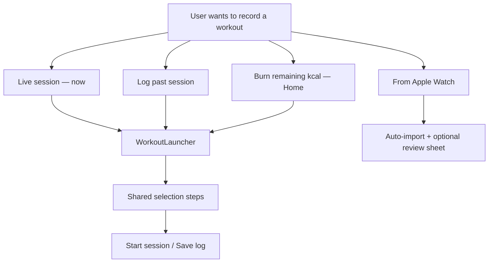
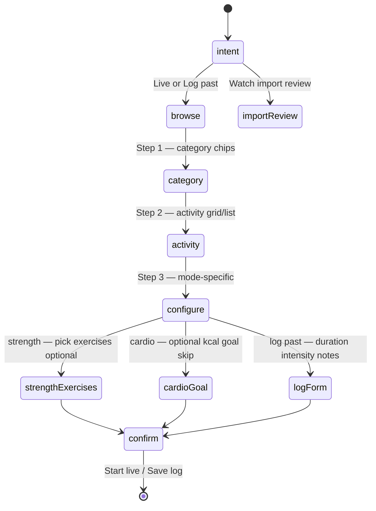
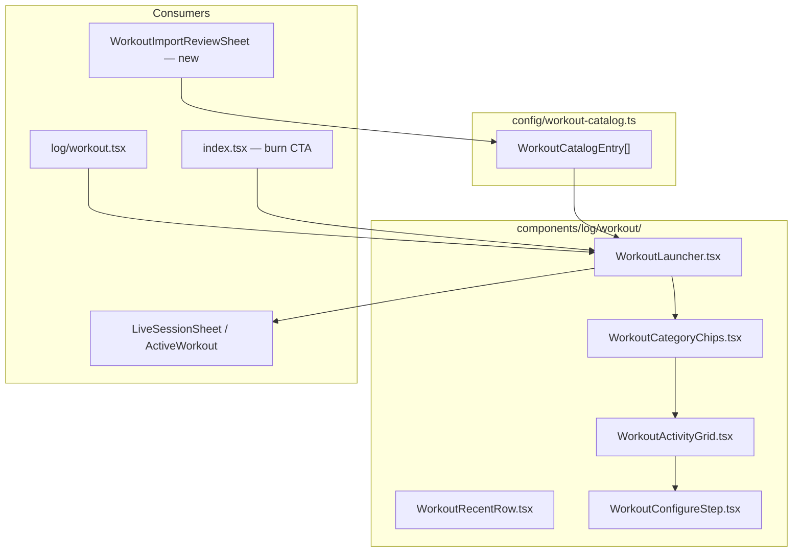
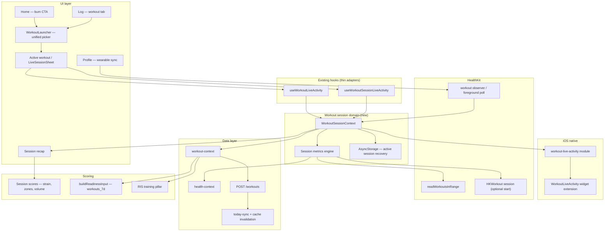
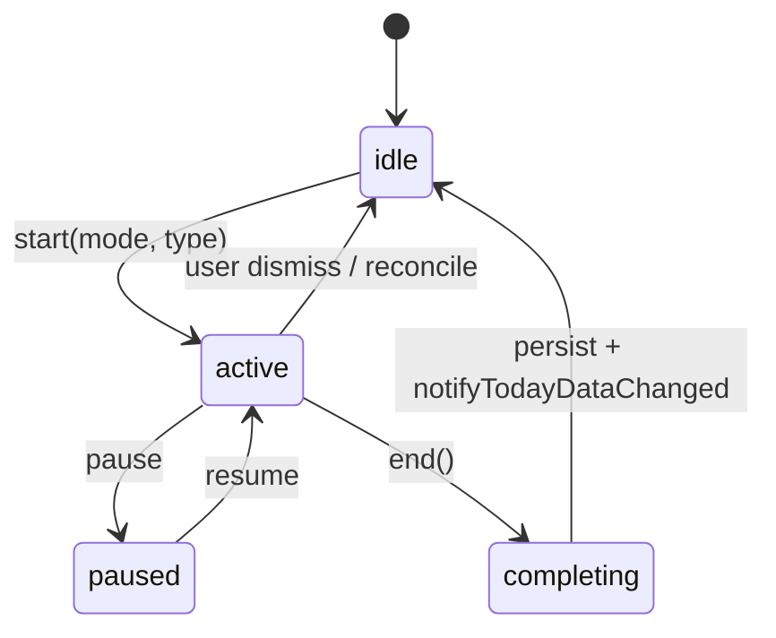
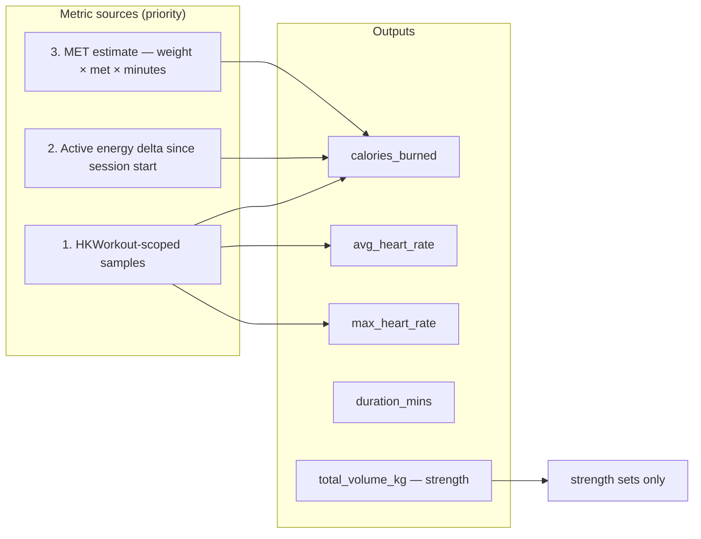
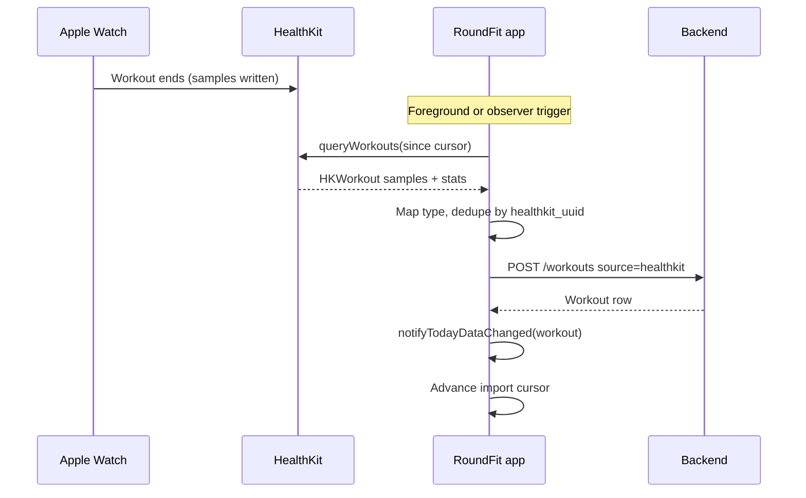
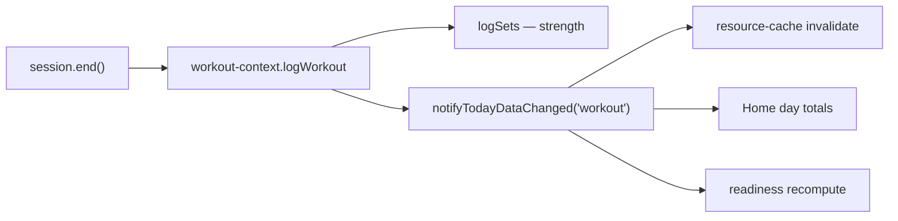

# Workout Session — Architecture & Implementation Plan

Live workout sessions, Live Activities, real-time metrics (calories, heart rate), session scores, immediate Apple Watch workout import, and a **redesigned workout selection flow**.

**Status:** Planning — no implementation yet.

---

## Product goal

One coherent **workout session** experience that:

1. Runs on the phone (cardio or strength) with a **Live Activity** on the lock screen and Dynamic Island.
2. Shows **live calories, heart rate, elapsed time**, and mode-specific stats (sets / volume for gym).
3. Computes **session scores** at end (and optionally during the session).
4. **Imports Apple Watch workouts** into RoundFit as soon as HealthKit receives them (foreground sync at minimum; background delivery when available).
5. Uses **one workout catalogue** and a clear step-by-step path to start, log, or import a session — no duplicate type lists or dead-end taps.

---

## Current state (baseline)

| Area | Status |
|------|--------|
| **Cardio / burn live activity** | `useWorkoutLiveActivity` on Home — calories from **today’s** `active_calories` delta; HR from daily average; 8s poll |
| **Gym live session** | `useWorkoutSessionLiveActivity` + `LiveSessionSheet` — sets, volume, timer; saves via `logWorkout` as **manual**, no calories / HR |
| **Native layer** | `workout-live-activity` Expo module + iOS widget extension; deep link `roundfit://workout-session` |
| **HealthKit** | Daily aggregates (steps, active energy, HR, etc.); `HKWorkoutTypeIdentifier` in permissions — **no workout read / observer yet** |
| **Backend model** | `Workout` supports `source: healthkit`, `avg_heart_rate`, `calories_burned`, `started_at` / `ended_at` |
| **Downstream scores** | Readiness uses `workouts_7d`; RIS training pillar uses sessions + intensity + calories |
| **Workout selection** | **Three separate catalogues** — see [Selection redesign](#workout-selection-redesign) |

### Main gaps

- No unified session model (two parallel live-activity hooks).
- No workout-scoped metrics (daily calorie delta is wrong if the user moves outside the session).
- No Apple Watch auto-import (`healthkit` source exists on the type but nothing writes it).
- Gym finish does not persist `calories_burned` or HR.
- No dedupe key for HealthKit workout UUIDs.
- **Fragmented workout picker UX** — Home burn list, Log live grid, and retrospective form do not share one taxonomy or flow.

---

## Workout selection redesign

Today the user can pick a workout in **four different places**, each with a different list and behaviour. The redesign unifies taxonomy and separates **intent** (live vs log past vs burn calories) from **activity** (run, gym, HIIT, etc.).

### Current selection (problems)

| Surface | File / component | Types shown | Behaviour |
|---------|------------------|-------------|-----------|
| Home calorie coach | `BurnActivityPicker` | 10 cardio-style activities (`walk`, `run`, `cycle`, …) | Pick activity + MET-derived minutes → starts **cardio** live activity |
| Log → Start live session | `LiveSessionSheet` | 6 types (`strength`, `run`, `cardio`, `hiit`, `yoga`, `other`) | **One tap = session starts** — no confirm, no goal |
| Log → Log a workout (FAB) | `LogWorkoutSheet` in `log/workout.tsx` | Same 6 types + exercise library for strength | Multi-page: type → exercises → form (duration, intensity, calories) |
| Backend / API | `WorkoutType` in `workout-context` | 10 canonical types (`gym`, `running`, `walking`, …) | Mapped via `UI_WORKOUT_TYPE_MAP` — incomplete vs UI lists |

**Pain points**

- User sees **Run** on Home and **Run** on Log but they start different flows (burn goal vs live session vs retrospective form).
- **Strength** on live session skips exercise planning; exercise picker only appears after start.
- **Cardio** on Log is vague; Home has granular activities (swim, row, hike) Log does not.
- No **recent workouts**, **favorites**, or **Watch-detected** entry point in the picker.
- Retrospective log and live session should share the same **activity id** end-to-end.

### Design principles

1. **One catalogue** — single source of truth for display label, icon, backend `WorkoutType`, session `mode`, MET (optional), and SF Symbol for Live Activity.
2. **Intent first** — user chooses *what they are doing* (live now / log completed / sync from Watch) before or alongside activity.
3. **Progressive steps** — never start a session on accidental tap; confirm with explicit **Start** (or **Log**).
4. **Mode-aware steps** — strength shows exercise step; cardio may show optional calorie goal; Watch import skips live UI.
5. **Same activity everywhere** — Home “burn remaining calories” pre-selects activity but still uses the shared catalogue.

### Unified workout catalogue

Introduce `config/workout-catalog.ts` (or `components/log/workout/catalog.ts`) — **do not** duplicate `WORKOUT_TYPES`, `BURN_ACTIVITIES`, and `WORKOUT_META` in separate files.

```ts
interface WorkoutCatalogEntry {
  id: string;                    // stable UI id e.g. 'run', 'strength'
  label: string;
  icon: IoniconName;
  sfSymbol: string;              // Live Activity widget
  backendType: WorkoutType;      // API canonical type
  sessionMode: 'strength' | 'cardio';
  met?: number;                  // for burn prescription on Home
  supportsSets: boolean;         // exercise library + set logging
  healthKitActivityType?: string; // map for import
}
```

**Suggested catalogue groups (UI)**

| Group | Examples | `sessionMode` | Notes |
|-------|----------|---------------|--------|
| **Strength & gym** | Strength training | `strength` | Exercise library, volume, sets LA |
| **Cardio** | Run, walk, cycle, swim, row, hike, dance | `cardio` | HR + kcal LA; MET for Home burn |
| **Classes & mixed** | HIIT, yoga | `cardio` or `strength` per entry | HIIT → cardio; yoga → low MET cardio |
| **Other** | Other | `cardio` | Fallback |

Migrate existing constants into this file; re-export thin aliases for backward compatibility during refactor.

### User intents (entry points)



| Intent | Primary entry | Ends in |
|--------|---------------|---------|
| **Live session** | Log tab CTA, deep link `workout-session`, optional Home | `WorkoutSessionContext.start()` + Live Activity |
| **Log past** | Log FAB, empty state | `logWorkout()` + optional `logSets()` — no Live Activity |
| **Burn remaining** | Home movement / calorie coach | Pre-filled activity + optional goal kcal → live session (cardio mode) |
| **Watch import** | Background + Wearables screen | `logWorkout({ source: 'healthkit' })` — review UI if user opens notification |

### Selection flow (new UX)

Replace tap-to-start grids with a **shared launcher** component: `WorkoutLauncher` (modal or full-screen sheet).



**Step 1 — Category (optional if list is short)**  
Horizontal chips: All · Strength · Cardio · Mind & body · Other.

**Step 2 — Activity**  
Searchable grid (icon + label). Show **Recent** (last 3 session types) and **Favorites** (pinned by user, v2) at top.

**Step 3 — Configure (depends on `sessionMode` + intent)**

| Mode | Live session | Log past |
|------|--------------|----------|
| **Strength** | Optional: pick 1+ exercises before start (or “add during session”) | Exercise multi-select → sets/reps/weight form (existing `LogWorkoutSheet` logic) |
| **Cardio** | Optional calorie target (default: off; Home pre-fills from remaining ring) | Duration, intensity, optional distance |

**Step 4 — Confirm**  
Primary CTA: **Start workout** or **Save workout**. Secondary: Back.

**Live session after confirm**  
- Single `LiveSessionSheet` (or renamed `ActiveWorkoutScreen`) — no embedded type picker; type comes from launcher state.  
- Strength: land on timer + add set; exercises from step 3 pre-seeded as chips.  
- Cardio: timer + live kcal/HR; no set UI.

### Component architecture (selection)



| Component | Max lines target | Responsibility |
|-----------|------------------|----------------|
| `WorkoutLauncher` | ~120 | Orchestrates steps, intent prop `live` \| `log` \| `burn` |
| `WorkoutActivityGrid` | ~100 | Grid + search; emits `WorkoutCatalogEntry` |
| `WorkoutConfigureStep` | ~120 | Strength exercises vs cardio goal vs log form fields |
| `WorkoutRecentRow` | ~60 | Reads last sessions from local cache or API |

**Props contract**

```ts
type WorkoutLauncherIntent = 'live' | 'log' | 'burn';

interface WorkoutLauncherProps {
  visible: boolean;
  onClose: () => void;
  intent: WorkoutLauncherIntent;
  /** Pre-select from Home burn coach */
  initialActivityId?: string;
  initialCalorieGoal?: number;
  onLiveStart: (selection: WorkoutSelection) => void;
  onLogSave: (selection: WorkoutSelection) => void;
}

interface WorkoutSelection {
  entry: WorkoutCatalogEntry;
  intent: WorkoutLauncherIntent;
  calorieGoal?: number;
  presetExercises?: string[];
  // log-only fields filled in configure step
  durationMins?: number;
  intensity?: Intensity;
}
```

### Home integration (burn remaining)

Keep the calorie-coach narrative on Home, but **route through the launcher**:

1. User taps movement / burn CTA → open `WorkoutLauncher` with `intent: 'burn'`, `initialCalorieGoal` = remaining kcal.
2. Activity list = catalogue entries where `met` is defined (cardio group).
3. On confirm → `onLiveStart` → same session engine as Log live (not a separate `BurnActivity` type).

Deprecate `BurnActivity` / `BURN_ACTIVITIES` in favour of catalogue entries; keep `computeDurationMinutes(met, weightKg, calories)` in a small util.

### Log tab integration

| Today | Target |
|-------|--------|
| “Start live session” card → `LiveSessionSheet` with internal type grid | Opens `WorkoutLauncher` `intent: 'live'` → on confirm opens active session UI only |
| FAB → `LogWorkoutSheet` with inline type scroll | Opens `WorkoutLauncher` `intent: 'log'` → configure → save (extract form tail from `LogWorkoutSheet`) |
| Empty state “Log a workout” | Same launcher `intent: 'log'` |

Reduce `log/workout.tsx` size by moving picker + form steps into launcher components (screen stays list + FAB + stats).

### Watch import review (selection-adjacent)

When import detects a new HK workout, optional **review sheet** (not full launcher):

- Shows mapped activity label + Watch icon + duration + kcal + HR  
- Actions: **Save**, **Change type** (opens activity grid only), **Discard**

Uses same `WorkoutCatalogEntry.healthKitActivityType` mapping as import pipeline.

### Analytics (selection)

| Event | When |
|-------|------|
| `workout_launcher_opened` | intent, entry_surface (`home`, `log`, `deep_link`) |
| `workout_activity_selected` | `activity_id`, `category` |
| `workout_live_started` | after confirm |
| `workout_logged_retroactive` | after save |
| `workout_import_reviewed` | save / change type / discard |

### Selection — implementation phase

| Step | Work |
|------|------|
| **S1** | Add `workout-catalog.ts`; map all ids to `WorkoutType` + `sessionMode` |
| **S2** | Build `WorkoutLauncher` (steps 1–4) for `live` intent only |
| **S3** | Wire Log tab + remove grid from `LiveSessionSheet` |
| **S4** | Wire Home burn CTA; remove duplicate `BURN_ACTIVITIES` |
| **S5** | `log` intent — migrate `LogWorkoutSheet` form into configure step |
| **S6** | Recent row + AsyncStorage; favorites (optional) |
| **S7** | Import review sheet |

Run **S1–S3** in parallel with session engine **Phase B** so live start passes a full `WorkoutSelection` into `WorkoutSessionContext`.

### Selection — success criteria

- [ ] One catalogue drives Home, Log live, Log past, and HealthKit import labels.
- [ ] Live session never starts without explicit **Start workout** tap.
- [ ] Strength user can optionally pick exercises before timer starts.
- [ ] Home burn flow uses same activity ids as Log cardio live session.
- [ ] `log/workout.tsx` screen file under 200 lines (list + composition only).

---

## System architecture

High-level view of how session, HealthKit, Live Activity, API, and scoring connect.



---

## Layer architecture

### 1. Presentation

| Surface | Responsibility |
|---------|----------------|
| `app/(tabs)/index.tsx` | Cardio quick-start, burn goal, ties into burn live activity |
| `components/log/workout/LiveSessionSheet.tsx` | Strength session UI — sets, timer, finish |
| `app/workout-session.tsx` | Deep link from widget → open sheet |
| `ios/WorkoutLiveActivity/*` | SwiftUI lock screen / Dynamic Island |
| Session recap (new) | Post-end summary — kcal, HR, strain, volume |

Screens stay thin; all session logic lives in context + hooks.

### 2. Session domain (new — central piece)

Single source of truth for an in-progress workout.



**Session modes**

| Mode | Entry | Live Activity fields |
|------|-------|----------------------|
| `cardio` | Home burn picker | `caloriesBurned`, `heartRate`, `goalCalories`, elapsed |
| `strength` | Log → live session | `setCount`, `lastExercise`, `totalVolumeKg`, elapsed (+ HR / kcal when available) |

**Session record (in-memory + optional AsyncStorage)**

```ts
interface WorkoutSession {
  id: string;
  mode: 'cardio' | 'strength';
  workoutType: string;       // UI id → mapped to WorkoutType on save
  workoutName: string;
  startedAt: number;
  pausedAt: number | null;
  baselineActiveCalories: number;
  healthkitUuid: string | null;  // bound HKWorkout, if any
  sets: SessionSet[];            // strength only
}
```

Existing `useWorkoutLiveActivity` and `useWorkoutSessionLiveActivity` become **adapters** over this context so Home and Log tabs do not break in one change.

### 3. Metrics engine

Resolves live and final numbers during `active` state.



| Priority | Source | When used |
|----------|--------|-----------|
| 1 | HealthKit workout window | Watch or phone `HKWorkout` exists for session interval |
| 2 | `active_calories` delta from baseline at start | HealthKit connected, no scoped workout |
| 3 | MET × profile weight × elapsed | Fallback / no HealthKit |

**Polling:** 2–4s while session active for JS state; push to Live Activity at most every ~8s (system throttling).

**Recommendation:** Call `HKWorkout` session APIs on phone session start when HealthKit is authorized — cleanest scoping and aligns with Watch.

### 4. HealthKit import pipeline

Watch workouts land in HealthKit; RoundFit pulls and dedupes.



**Triggers for “immediate enough”**

| Trigger | Behaviour |
|---------|-----------|
| `AppState` → `active` | Incremental import since `@roundfit/healthkit_workout_cursor` |
| Foreground interval | Poll every 30–60s while app open |
| HealthKit background delivery | Observer on workout type → import (if library supports) |
| Active phone session | If new HK workout overlaps session → bind or prompt user |

**Dedupe:** `healthkit_uuid` unique per user on backend; skip POST if already imported.

**Overlap with manual session:** If manual session `started_at`/`ended_at` within ±2 min of HK workout, prefer HealthKit for calories / HR or merge into one row (product decision).

### 5. Live Activity (native)

Two attribute structs exist today (`WorkoutActivityAttributes` for cardio burn, `WorkoutSessionAttributes` for gym). Target state:

- **Option A (preferred):** One unified `ContentState` with optional fields for both modes; widget switches layout by `mode`.
- **Option B:** Keep two Activity types; unify only JS session state.

Native rule (already in codebase): struct definitions must be **byte-identical** across the Expo module target and the widget extension target.

```
modules/workout-live-activity/ios/WorkoutLiveActivityModule.swift
        ↕ mirror
ios/WorkoutLiveActivity/ActivityAttributes.swift
plugins/WorkoutLiveActivity/ActivityAttributes.swift
```

Bridge API (existing, extend as needed):

- `startLiveActivity` / `startSessionLiveActivity` → consolidate
- `updateLiveActivity` / `updateSessionLiveActivity`
- `endLiveActivity` / `endSessionLiveActivity`
- `getCurrentLiveActivityState` — lock-screen pause/resume sync

### 6. Persistence & sync



**`LogWorkoutInput` on finish (target)**

```ts
{
  type, duration_mins, intensity,
  source: healthkitUuid ? 'healthkit' : 'manual',
  calories_burned, avg_heart_rate, max_heart_rate,
  started_at, ended_at,
  healthkit_uuid?,   // new — dedupe
  metrics?,          // optional JSON — strain, zones
}
```

---

## Session scores

Computed at session end; optional live `strain` on Live Activity once stable.

| Score | Inputs | Notes |
|-------|--------|------|
| **Calories** | HK energy or MET estimate | Badge: Watch / Health / Estimated |
| **Cardio load** | HR zone minutes × duration | Zones from age-based max HR or user setting |
| **Strength load** | `totalVolumeKg`, set count, duration | Already tracked in session LA |
| **Strain (0–100)** | duration × intensity × HR factor | Align with `inferSorenessFromWorkouts` |
| **Goal %** | vs `goalCalories` — cardio | Already on burn live activity |

**Downstream (no new collection)**

| Consumer | Uses |
|----------|------|
| Home calorie ring / movement | Day `workouts` sum |
| `buildReadinessInput` | `workouts_7d` |
| RIS training pillar | Sessions, intensity, calories burned |

---

## HealthKit mapping

`HKWorkoutActivityType` → backend `WorkoutType` (examples):

| HealthKit | RoundFit `WorkoutType` |
|-----------|------------------------|
| Running | `running` |
| Walking | `walking` |
| Cycling | `cycling` |
| Swimming | `swimming` |
| Traditional strength | `gym` |
| HIIT | `hiit` |
| Yoga | `yoga` |
| Rowing | `rowing` |
| Other | `other` |

Extract per sample: `uuid`, `startDate`, `endDate`, `duration`, `totalEnergyBurned`, heart rate statistics, `totalDistance`, `sourceRevision` (Watch vs iPhone).

New utilities in `utils/healthkit.ts`:

- `fetchWorkoutsSince(cursor: Date)`
- `mapHealthKitWorkoutToLogInput(sample)`
- `getActiveHealthKitWorkout()` — for binding live session
- `subscribeToWorkoutUpdates(callback)` — if supported by `@kingstinct/react-native-healthkit`

---

## Backend considerations

Confirm or add before import goes live:

| Field | Purpose |
|-------|---------|
| `healthkit_uuid` | Idempotent import, unique per `user_id` |
| `metrics` (JSON) | Optional — `strain_score`, `hr_zone_minutes`, `volume_kg` |

If the API already accepts arbitrary metadata, document the contract; otherwise add a migration.

---

## Implementation phases

### Phase A — Apple Watch import (highest leverage)

1. `fetchWorkoutsSince` + type mapping in `utils/healthkit.ts`.
2. Import service: dedupe, `logWorkout({ source: 'healthkit', ... })`.
3. Cursor in AsyncStorage; run on foreground + wearable manual sync.
4. UX: “Imported from Watch” on rows; wearable screen last-import time.

### Phase B — Unified session + persist metrics

1. `WorkoutSessionContext` + provider in `app/_layout.tsx`.
2. Refactor existing live-activity hooks as adapters.
3. `LiveSessionSheet` finish: pass calories, HR, `started_at` / `ended_at`.
4. AsyncStorage recovery for killed app mid-session.
5. Accept `WorkoutSelection` from launcher (catalogue entry + preset exercises + optional calorie goal).

### Phase C — Live metrics + Live Activity

1. Metrics engine with HK workout → delta → MET priority.
2. Faster poll while active; unified `updateLiveActivity` payload.
3. Optional: start `HKWorkout` on session start.
4. Widget layout for HR + kcal on strength mode.

### Phase D — Background immediacy

1. HealthKit observer / background delivery (platform + library permitting).
2. Optional local notification: “Run saved — 320 kcal”.

### Phase E — Session scores + recap UI

1. Strain / zones / volume formulas.
2. Post-session recap modal or sheet.
3. PostHog: `workout_session_started`, `workout_session_ended`, `workout_imported_watch`.

---

## Suggested build order (single day)

| Order | Deliverable |
|-------|-------------|
| 1 | **S1** — `workout-catalog.ts` |
| 2 | Phase A — watch import + dedupe |
| 3 | **S2–S3** — `WorkoutLauncher` + wire Log live (remove inline type grid) |
| 4 | Phase B — session context + finish persist |
| 5 | Phase C — live metrics + LA updates |
| 6 | **S4** — Home burn → launcher |
| 7 | Phase D — foreground poll (background observer if time) |
| 8 | **S5–S7** — log past migrate, recent, import review |
| 9 | Phase E — scores + recap |

Minimum viable slice: **S1 + S2–S3 + A + B + C**.

---

## Key decisions (resolve before coding)

| # | Question | Recommendation |
|---|----------|----------------|
| 1 | Add `healthkit_uuid` + unique index? | Yes |
| 2 | Unify one Live Activity widget vs two? | Unify JS first; widget can follow |
| 3 | Calories authority when manual + HK overlap? | HealthKit wins for energy / HR |
| 4 | HR zones | Age-based max HR default; profile override later |
| 5 | Start `HKWorkout` on phone session start? | Yes when HealthKit connected |

---

## Files likely touched

| Layer | Files |
|-------|--------|
| **Catalogue & launcher** | `config/workout-catalog.ts` (new), `components/log/workout/WorkoutLauncher.tsx` (new), `WorkoutActivityGrid.tsx`, `WorkoutConfigureStep.tsx`, `WorkoutRecentRow.tsx` |
| HealthKit | `utils/healthkit.ts`, `context/health-context.tsx` |
| Session | `context/workout-session-context.tsx` (new), `hooks/use-workout-live-activity.ts`, `hooks/use-workout-session-live-activity.ts` |
| UI | `components/log/workout/LiveSessionSheet.tsx`, `components/home/burn-activity-picker.tsx` (thin or deprecated), `app/(tabs)/index.tsx`, `app/(tabs)/log/workout.tsx` |
| Native | `modules/workout-live-activity/`, `ios/WorkoutLiveActivity/*`, `plugins/WorkoutLiveActivity/*` |
| API | `context/workout-context.tsx` |
| Sync | `utils/today-sync.ts`, `utils/cache-invalidation.ts` |
| Profile | `app/(tabs)/profile/wearable.tsx` |
| App root | `app/_layout.tsx` |
| **Deprecate** | `components/log/workout/constants.ts` `WORKOUT_TYPES` (re-export from catalog), `BURN_ACTIVITIES` |

---

## Testing matrix

| Scenario | Expected |
|----------|----------|
| Phone-only gym session | LA shows sets; finish saves duration, sets, kcal/HR if HK available |
| Phone cardio from Home | LA shows kcal / HR / goal % |
| Watch-only run, app opened after | Workout imported once, no duplicate UUID |
| Watch run while app backgrounded | Import on next foreground (stretch: background) |
| Pause / resume from lock screen | Timer excludes pause; LA `isActive` synced |
| Kill app mid-session | Recovery prompt or discard from AsyncStorage |
| Double import same UUID | Second POST skipped |
| Concurrent daily activity + session | HK workout scope avoids inflated delta |
| Home burn → confirm → live | Same activity as Log cardio; calorie goal passed to session |
| Log live — back from configure | No session started until confirm |
| Log past — strength with presets | Exercises pre-filled in form |
| Watch import review — change type | Catalogue grid only; save updates `WorkoutType` |

---

## Success criteria

- [ ] User finishes a **Watch workout** → appears in Log / Home after foreground open (stretch: without opening app).
- [ ] **Live gym session** → lock screen shows timer + sets; finish includes calories and avg HR when HealthKit provides them.
- [ ] **Cardio from Home** → Live Activity tracks session-scoped burn when `HKWorkout` is active.
- [ ] No duplicate rows for the same `healthkit_uuid`.
- [ ] Day totals, readiness, and RIS training see imported and live-logged sessions the same day.
- [ ] **Selection:** one catalogue; live session requires confirm; Home and Log share activity ids.

---

## Related docs

- [RIS architecture](./ris-architecture.md) — training pillar inputs
- [Backend recovery & readiness](./backend-recovery-readiness.md) — readiness inputs
- [Cache consolidation plan](./cache-consolidation-plan.md) — `notifyTodayDataChanged` domains
